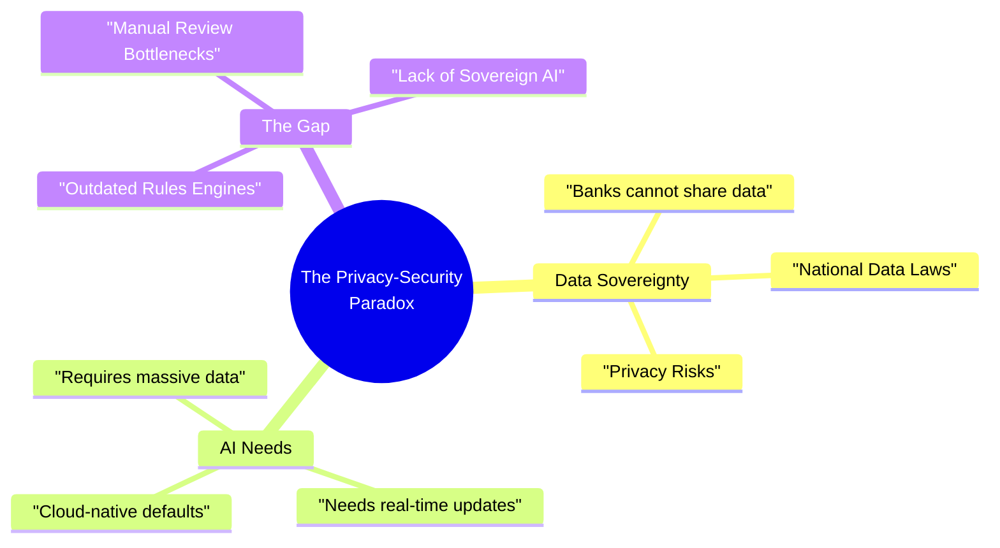
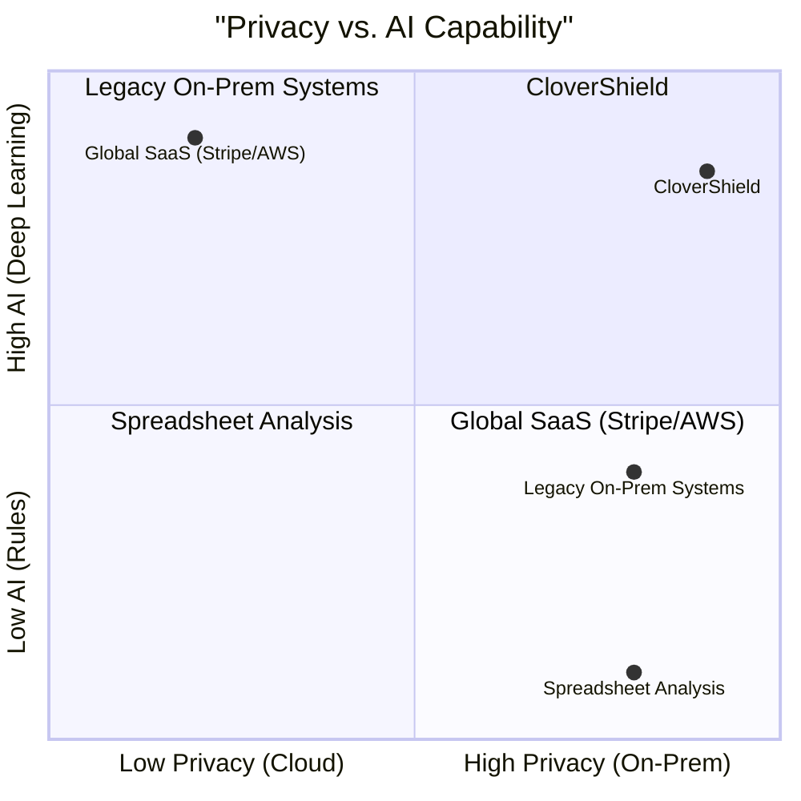

# CloverShield: Sovereign AI Fraud Analyst Workstation
## Project Overview

---

## Problem Statement

### The Market Gap Visualized

We analyzed the current landscape. Solutions either offer high AI capability (but require cloud data sharing) or high privacy (but are dumb rule-engines). CloverShield captures the empty "High Privacy + High AI" quadrant.

### The Challenge

Bangladesh's mobile financial services (MFS) sector faces a critical dilemma. While fraud tactics are evolving into sophisticated, coordinated syndicate attacks, the defense mechanisms remain outdated.

- **The Data Privacy Barrier:** Financial institutions **cannot** share private user transaction data with third-party SaaS fraud solutions due to strict national data sovereignty laws and competitive secrecy.
- **The "Black Box" Problem:** Traditional AI solutions are opaque. When a transaction is blocked, human analysts often don't know *why*, leading to high false positives and customer friction.
- **The Analyst Bottleneck:** Human fraud analysts are overwhelmed. They lack tools to visualize complex money laundering networks or safely test new policy rules without breaking the live system.

---

## The Solution: Sovereign AI

**CloverShield** is not just another fraud detection model; it is a **Sovereign AI Fraud Analyst Workstation**.

Instead of asking banks to send their data to the cloud, we bring the AI to the data. CloverShield is designed as a **self-contained, Dockerized ecosystem** that MFS providers can deploy **on-premise**.

### Key Value Propositions
1.  **Detect** fraud in real-time using models trained on their private data.
2.  **Investigate** using interactive network graphs and XAI (Explainable AI).
3.  **Adapt** by backtesting new fraud rules in a safe "Policy Lab" environment.

---

## Target Users

### 1. Enterprise Fraud Analysts (Primary)
- **Role:** Security officers at bKash, Nagad, or Bank Asia.
- **Need:** A unified dashboard to investigate alerts, visualize money flow, and explain decisions to customers.

### 2. Chief Risk Officers (CROs)
- **Role:** Executive decision-makers.
- **Need:** Assurance that data never leaves their servers ("Zero-Trust Deployment") and tools to audit model performance.

### 3. Compliance Teams
- **Role:** Regulatory auditors.
- **Need:** "Glass-box" transparency—knowing exactly why a model flagged a transaction (SHAP values).

---

## Local Relevance: Built for Bangladesh's Infrastructure

### 1. Data Sovereignty & Compliance
In Bangladesh, financial data is a national asset. CloverShield respects this by design. Our **"Ship the Code, Not the Data"** philosophy means the entire workstation runs inside the bank's secure firewalls. No API calls to foreign servers for inference.

### 2. Operational Resilience
Internet connectivity can be unstable. Since CloverShield runs locally (On-Premise), it guarantees **<200ms latency** and 100% uptime regardless of international internet cable disruptions.

### 3. Bilingual Analyst Support
Field analysts across Bangladesh may prefer Bangla. Our workstation offers a **fully localized interface**, generating AI explanations in Bangla to speed up decision-making.

---

## Scalability: The "Dockerized" Advantage

### Zero-Trust Deployment Strategy
We recognize that we cannot train on real bank data for this hackathon. Instead, we provide a **Production-Ready Container System**:

1.  **Synthetic Training Pipeline:** We include a Jupyter Notebook training pipeline using PaySim (synthetic data) as a template. Banks can simply swap the dataset file with their private logs to retrain the model securely.
2.  **One-Command Setup:** The entire system—Frontend, API, Database—spins up with `docker-compose up`.
3.  **Horizontal Scaling:** The stateless ML API container can be replicated across multiple internal servers to handle millions of transactions per second.

### Technical Stack for Sovereignty

| Component | Technology | Purpose |
|-----------|-----------|---------|
| **Deployment** | **Docker & Docker Compose** | Portable, on-premise deployment. |
| **Frontend** | **Next.js (React)** | The "Mission Control" dashboard for analysts. |
| **AI Engine** | **FastAPI + XGBoost** | High-performance, low-latency inference. |
| **Database** | **Supabase (Self-Hosted)** | Local data persistence and real-time updates. |

---

**Team:** Clover Crew | **Location:** Rajshahi | **Competition:** National AI Build-a-thon 2026 (MXB2026)
