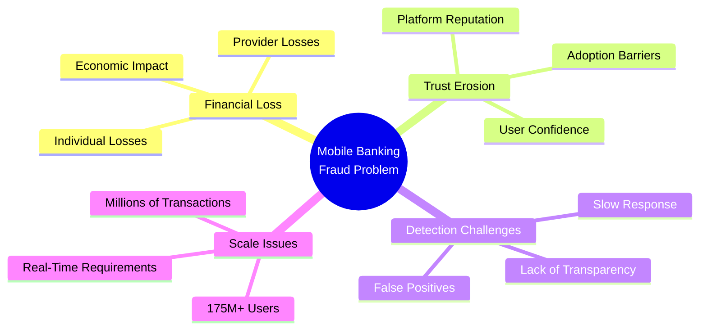

# CloverShield: AI-Powered Mobile Banking Fraud Detection System
## Project Overview

---

## Problem Statement

### The Challenge

Bangladesh's mobile financial services (MFS) ecosystem—led by **bKash, Nagad, Upay, and Rocket**—has revolutionized financial inclusion but faces critical fraud threats:

- **Fraud Types**:
  - Account takeover attacks
  - Unauthorized transaction manipulation
  - SIM swap fraud
  - Sophisticated phishing campaigns

- **Impact**:
  - Financial losses (individual to life savings)
  - Erosion of user trust in digital financial services
  - Threat to digital economy sustainability

- **Current Limitations**:
  - Reactive, rule-based detection systems
  - Manual review processes overwhelmed by transaction volumes
  - Delayed responses and missed fraudulent activities
  - Gap between fraud sophistication and detection capabilities

---

## Target Users

### 1. End Users (175M+ Mobile Banking Users)
- **Scope**: 175 million+ users across Bangladesh (urban and rural)
- **Needs**:
  - Transparent, real-time protection
  - Non-disruptive transaction experience
  - Bilingual interface (English and Bangla)

### 2. Mobile Financial Service Providers (MFS Providers)
- **Platforms**: bKash, Nagad, Upay, Rocket, and others
- **Benefits**:
  - Reduced operational costs (less manual fraud review)
  - Improved customer protection
  - Explainable AI for compliance teams
  - Scalable architecture for existing infrastructure

### 3. MFS Agents and Merchant Networks
- **Role**: Facilitate cash-in/cash-out operations
- **Benefits**:
  - Identify suspicious transaction patterns
  - Reduce exposure to fraudulent activities
  - Maintain transaction flow efficiency

---

## Local Relevance: Critical for Bangladesh's Digital Economy

### Strategic Importance
- **Vision 2041 & Digital Bangladesh**: MFS positioned as cornerstone of economic development
- **Daily Integration**: Mobile banking deeply integrated into daily life
  - Remittance transfers supporting rural families
  - Small business transactions powering local economies

### Risk of Inaction
- Single high-profile fraud incident can trigger widespread panic
- Reduced MFS adoption undermines years of financial inclusion progress

### Bangladesh-Specific Design
- **Bilingual Support**: Accessibility across diverse demographics
- **Microservices Architecture**: Accommodates varying infrastructure across regions
- **Real-Time Detection**: Addresses high transaction volumes
- **Geographic Distribution**: Reduces latency across Bangladesh's diverse geography

---

## Scalability: Handling Millions of Transactions

### Architecture Approach
- **Microservices Design**: Separates concerns, enables independent scaling
- **Performance Target**: Sub-200ms response time per transaction
- **Horizontal Scaling**: Components scale independently to handle peak loads

### Technical Stack

| Component | Technology | Deployment | Status |
|-----------|-----------|------------|--------|
| **Frontend** | Next.js | Vercel | Production |
| **ML API** | FastAPI | Render → Hugging Face Spaces (planned) | Current → Planned |
| **Database** | Supabase/PostgreSQL | Supabase | Production |

### Performance Optimizations
- **XGBoost Model**: Optimized for real-time inference
- **Feature Engineering**: Efficient pipelines with pre-computed statistics
- **Asynchronous Processing**: Handles high-volume concurrent requests
- **Database Optimization**: Efficient query performance as transaction history grows

### Scale Capabilities
- **Current**: Millions of daily transactions
- **Future**: Billions of transactions without compromising accuracy or response time
- **Geographic**: Multi-region deployment for low latency

---

**Team:** Clover Crew | **Location:** Rajshahi | **Competition:** National AI Build-a-thon 2026 (MXB2026)
