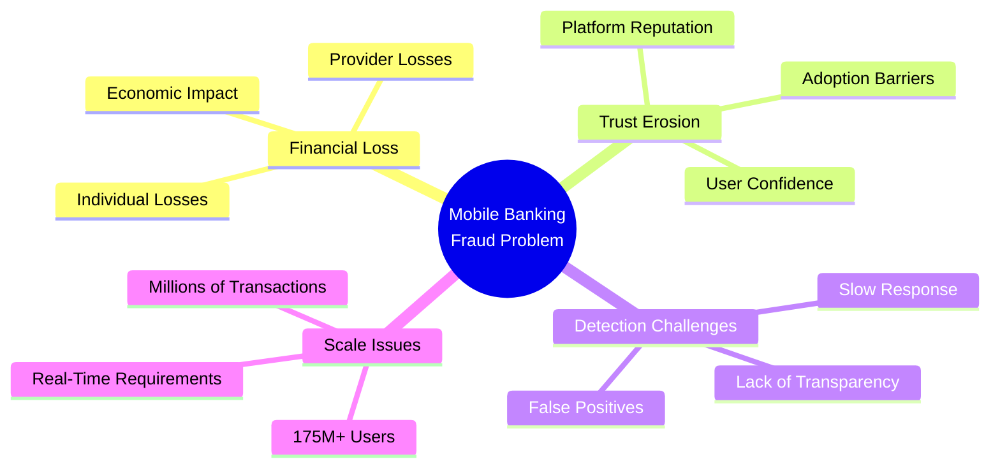

# CloverShield: AI-Powered Mobile Banking Fraud Detection System
## Project Overview

---

## Problem Statement

Bangladesh's mobile financial services (MFS) ecosystem, led by platforms like bKash, Nagad, Upay, and Rocket, has revolutionized financial inclusion, bringing banking services to millions of previously unbanked citizens. However, this rapid digital transformation has created a fertile ground for sophisticated fraud schemes that threaten the integrity of the entire system.

Mobile banking fraud in Bangladesh manifests in multiple forms: account takeover attacks, unauthorized transaction manipulation, SIM swap fraud, and sophisticated phishing campaigns targeting MFS users. These fraudulent activities result in substantial financial losses for both consumers and service providers, with individual losses ranging from small amounts to life savings. Beyond immediate monetary damage, fraud erodes the fundamental trust that underpins digital financial services—a trust that took years to build but can be destroyed in moments.

The current fraud detection mechanisms employed by MFS providers are largely reactive, rule-based systems that struggle to keep pace with evolving attack vectors. Manual review processes are overwhelmed by transaction volumes, leading to delayed responses and missed fraudulent activities. This gap between fraud sophistication and detection capabilities creates a critical vulnerability in Bangladesh's digital economy, where millions of transactions occur daily across rural and urban areas.

---

## Target Users

CloverShield serves three primary user groups critical to Bangladesh's mobile banking ecosystem:

**1. End Users (175M+ Mobile Banking Users)**
The system protects the 175 million+ mobile banking users across Bangladesh, including both tech-savvy urban users and first-time digital financial service adopters in rural areas. These users require transparent, real-time protection that doesn't disrupt their transaction experience. CloverShield's bilingual interface (English and Bangla) ensures accessibility for all users, providing clear explanations of fraud risks in their preferred language.

**2. Mobile Financial Service Providers (MFS Providers)**
bKash, Nagad, Upay, Rocket, and other MFS providers benefit from CloverShield's real-time fraud detection capabilities, which reduce operational costs associated with manual fraud review while improving customer protection. The system's explainable AI features enable compliance teams to understand fraud patterns and make informed decisions, while the scalable architecture supports integration into existing MFS infrastructure.

**3. MFS Agents and Merchant Networks**
The extensive network of MFS agents and merchants who facilitate cash-in/cash-out operations require fraud detection tools that protect both their businesses and their customers. CloverShield helps agents identify suspicious transaction patterns, reducing their exposure to fraudulent activities while maintaining transaction flow efficiency.

---

## Local Relevance: Critical for Bangladesh's Digital Economy

Bangladesh stands at a pivotal moment in its digital transformation journey. The country's Vision 2041 and Digital Bangladesh initiatives have positioned mobile financial services as a cornerstone of economic development, financial inclusion, and poverty reduction. However, the sustainability of this digital economy depends entirely on maintaining user trust and system security.

Mobile banking has become deeply integrated into daily life in Bangladesh—from remittance transfers supporting rural families to small business transactions powering local economies. A single high-profile fraud incident can trigger widespread panic, leading to reduced MFS adoption and undermining years of financial inclusion progress. CloverShield addresses this existential threat by providing proactive, AI-driven protection that scales with Bangladesh's growing digital economy.

The system's design reflects Bangladesh-specific considerations: bilingual support ensures accessibility across diverse user demographics, the microservices architecture accommodates varying infrastructure capabilities across regions, and the real-time detection capability addresses the high transaction volumes characteristic of Bangladesh's MFS ecosystem. By protecting the digital financial infrastructure, CloverShield safeguards not just individual transactions but the entire foundation of Bangladesh's digital economy.

---

## Scalability: Handling Millions of Transactions

CloverShield is architected to handle the massive transaction volumes characteristic of Bangladesh's mobile banking ecosystem, where millions of transactions occur daily across multiple MFS platforms. The system achieves this scalability through a modern microservices architecture that separates concerns and enables independent scaling of components.

The core fraud detection engine, powered by an optimized XGBoost model, delivers sub-200ms response times per transaction—critical for real-time decision-making in high-volume environments. This performance is achieved through efficient feature engineering pipelines, model optimization techniques, and asynchronous processing capabilities. The FastAPI-based ML inference service is currently deployed on Render and can horizontally scale to handle peak transaction loads. The team plans to migrate to Hugging Face Spaces to leverage specialized ML infrastructure for even faster inference times and more efficient feature engineering operations. The Next.js frontend deployed on Vercel provides global edge distribution for low-latency user interactions.

The system's scalability extends beyond transaction volume to include geographic distribution. The microservices architecture allows deployment across multiple regions, reducing latency for users across Bangladesh's diverse geography. Database optimization through Supabase's PostgreSQL backend ensures efficient query performance even as transaction history grows into the millions. This scalable design ensures that CloverShield can grow alongside Bangladesh's expanding digital economy, protecting transactions as they scale from millions to billions without compromising detection accuracy or response time.

---

**Team:** Clover Crew | **Location:** Rajshahi | **Competition:** National AI Build-a-thon 2026 (MXB2026)

