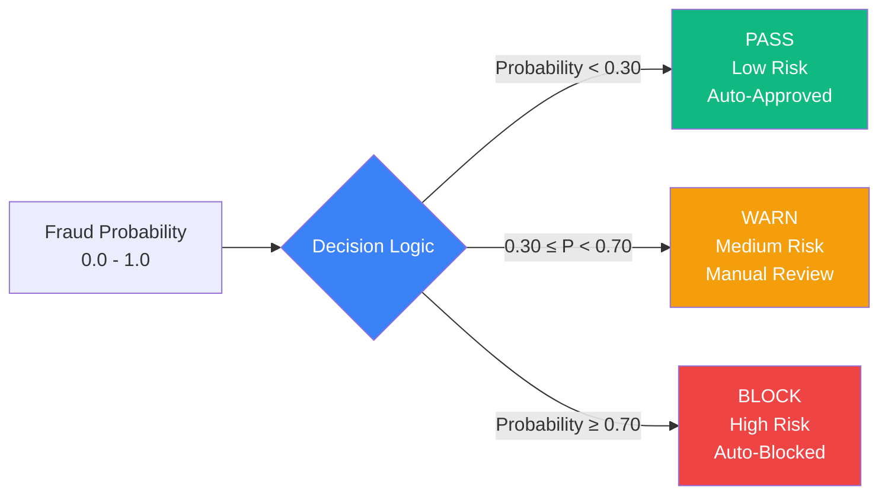

# CloverShield: Solution Description
## Technical Implementation and User Flow

---

## Core Features

### Real-Time Fraud Detection

CloverShield processes transaction data through an optimized XGBoost classifier that delivers fraud probability scores in under 200 milliseconds per transaction. The system receives raw transaction data (amount, sender/receiver balances, transaction type, timestamps) and returns a fraud probability score between 0 and 1, enabling real-time decision-making without disrupting transaction flow.

The detection pipeline consists of three stages: feature engineering, model inference, and decision calculation. Feature engineering transforms raw transaction data into 15 engineered features including graph-based metrics (PageRank, in-degree, out-degree), frequency patterns (transaction counts per account), ratio features (amount relative to user's historical patterns), and temporal features (hour of day). The XGBoost model, trained on 2.63 million transactions with optimized hyperparameters, generates fraud probability scores that are then mapped to three-tier decisions.

### Explainable AI: SHAP and Groq LLM

The system provides two levels of explainability for fraud detection decisions. SHAP (SHapley Additive exPlanations) generates feature contribution values that quantify how each engineered feature influences the fraud probability score. The system returns the top 10 features ranked by absolute SHAP value, showing which transaction characteristics (e.g., unusual amount ratio, low network trust score, abnormal transaction frequency) contribute most to the risk assessment.

For user-facing explanations, the system optionally integrates Groq LLM (Llama 3.1) to generate human-readable fraud risk explanations in English or Bangla. The LLM receives the fraud probability, SHAP feature contributions, and transaction details, then produces plain-language explanations that avoid technical jargon. These explanations help users understand why a transaction was flagged, what red flags were detected, and what actions they should take.

### Bilingual User Interface

The frontend application supports full bilingual operation in English and Bangla (বাংলা). All user-facing text, including transaction status messages, risk explanations, error messages, and analytics dashboard labels, are dynamically translated based on user preference. The bilingual support extends to the LLM-generated explanations, ensuring that users receive fraud risk information in their preferred language. This feature is critical for Bangladesh's diverse user base, where many mobile banking users are more comfortable with Bangla than English.

---

## User Journey: Transaction Flow

### 1. Transaction Initiation

When a user initiates a transaction through the MFS platform (bKash, Nagad, Upay, or Rocket), the transaction details are captured and sent to CloverShield's ML inference API. The transaction payload includes: transaction type (TRANSFER or CASH_OUT), amount, sender account identifier, sender balance before and after transaction, receiver account identifier, and receiver balance before and after transaction.

### 2. Risk Analysis

The ML inference service receives the transaction data and performs feature engineering in real-time. The feature engineer applies pre-computed statistics (user transaction history, network graph metrics) to transform raw transaction data into the feature vector expected by the XGBoost model. The model generates a fraud probability score, and if SHAP explanations are requested, the system computes feature contribution values. If LLM explanations are enabled, the system generates a human-readable explanation using the Groq API.

The entire risk analysis process completes in under 200 milliseconds, ensuring minimal impact on transaction processing time. The system returns a fraud probability score (0.0 to 1.0), a three-tier decision (PASS, WARN, or BLOCK), a risk level (low, medium, or high), and optional explanations.

### 3. Decision: PASS, WARN, or BLOCK

The fraud probability score is mapped to a three-tier decision system:

**PASS (Low Risk)**: Fraud probability < 0.30
- Transaction is approved automatically
- No user intervention required
- Suitable for transactions that match normal user patterns

**WARN (Medium Risk)**: 0.30 ≤ Fraud probability < 0.70
- Transaction requires manual review by MFS security team
- Transaction may proceed after review
- User may be notified of potential risk
- Suitable for transactions with some suspicious characteristics but insufficient evidence for automatic blocking

**BLOCK (High Risk)**: Fraud probability ≥ 0.70
- Transaction is automatically blocked
- User is notified of the block
- Security team is alerted for investigation
- Suitable for transactions with strong indicators of fraudulent activity

This three-tier system balances fraud prevention with user experience. The PASS threshold (0.30) allows legitimate transactions to proceed without friction, while the BLOCK threshold (0.70) ensures high-confidence fraud cases are stopped immediately. The WARN tier provides a buffer for edge cases that require human judgment.

### 4. User Notification

Based on the decision, users receive appropriate notifications through the MFS platform. For PASS decisions, users see a standard transaction confirmation. For WARN decisions, users may receive a notification indicating that their transaction is under review, with an estimated review time. For BLOCK decisions, users receive an immediate notification explaining that the transaction was blocked due to security concerns, along with contact information for dispute resolution.

If LLM explanations are enabled, users receive human-readable explanations of the fraud risk assessment in their preferred language (English or Bangla). These explanations help users understand why their transaction was flagged and what steps they can take, reducing confusion and support ticket volume.

---

## Decision Logic: Thresholds and Optimization

### Model Threshold: 0.00754482

The XGBoost model uses a decision threshold of 0.00754482, optimized for 99% recall on the training dataset. This threshold was determined through precision-recall curve analysis on cross-validated predictions, prioritizing the detection of fraudulent transactions (minimizing false negatives) over reducing false positives. This threshold choice reflects the critical importance of catching fraud cases in mobile banking, where a single missed fraud can result in significant financial loss for users.

The threshold of 0.00754482 is unusually low compared to typical binary classification thresholds (often 0.5), which reflects the extreme class imbalance in fraud detection (approximately 498:1 ratio of legitimate to fraudulent transactions in the training data). The model's `scale_pos_weight` parameter (498) compensates for this imbalance during training, but the low threshold ensures that even transactions with relatively low fraud probability scores are flagged if they exceed the optimized threshold.

### Risk Threshold Mapping

While the model threshold (0.00754482) is used for binary fraud detection, the system maps the continuous fraud probability score to three-tier decisions using risk thresholds:

- **PASS**: Probability < 0.30 (Low risk)
- **WARN**: 0.30 ≤ Probability < 0.70 (Medium risk)  
- **BLOCK**: Probability ≥ 0.70 (High risk)

This mapping provides operational flexibility. Transactions with probability scores between 0.00754482 and 0.30 are flagged by the model as potentially fraudulent (exceeding the binary threshold) but are assigned a PASS decision with low risk level, allowing them to proceed with monitoring. Transactions with scores between 0.30 and 0.70 receive WARN status, triggering manual review. Only transactions with scores ≥ 0.70 are automatically blocked.

The risk thresholds (0.30 and 0.70) were chosen to balance fraud detection sensitivity with operational efficiency. The 0.30 threshold for WARN ensures that transactions with moderate risk indicators are reviewed without overwhelming security teams, while the 0.70 threshold for BLOCK ensures that only high-confidence fraud cases trigger automatic blocking, minimizing false positives that could frustrate legitimate users.

---

## Technical Architecture

### Microservices Design

CloverShield follows a microservices architecture with three main components:

1. **Frontend (Next.js)**: React-based web application deployed on Vercel, providing the user interface for transaction submission, risk visualization, and explanation display. The frontend communicates with the ML API via REST endpoints and stores transaction history in Supabase.

2. **ML API (FastAPI)**: Python microservice for fraud prediction, currently deployed on Render. The team plans to migrate to Hugging Face Spaces to leverage specialized ML infrastructure for faster inference times and more efficient feature engineering operations, further reducing the sub-200ms response time target.

2. **ML Inference API (FastAPI)**: Python microservice that handles fraud detection logic. The service loads the trained XGBoost model and feature engineer on startup, processes incoming transaction requests, and returns predictions with optional explanations. The API is designed for horizontal scaling to handle high transaction volumes.

3. **Database (Supabase/PostgreSQL)**: Stores transaction history, user authentication data, and analytics. Row-level security policies ensure data isolation between users and MFS providers.

**Deployment Status:**
- Frontend: Vercel (production)
- ML API: Render (current), Hugging Face Spaces (planned migration)
- Database: Supabase (production)

### Feature Engineering Pipeline

The feature engineering process transforms raw transaction data into 15 engineered features:

- **Graph Features**: PageRank score (network trust), in-degree (receiver transaction count), out-degree (sender transaction count)
- **Frequency Features**: Transaction counts for sender and receiver accounts
- **Ratio Features**: Amount relative to user's mean/median transaction amounts, amount relative to account balance
- **Temporal Features**: Hour of day extracted from transaction timestamp
- **Type Encoding**: Categorical encoding for TRANSFER and CASH_OUT transaction types

The feature engineer is fitted on a sample of historical transaction data (typically 50,000 rows) to compute user statistics and network graph metrics. During inference, these pre-computed statistics are applied to new transactions to generate feature vectors in real-time.

---

**Team:** Clover Crew | **Location:** Rajshahi | **Competition:** National AI Build-a-thon 2026 (MXB2026)

