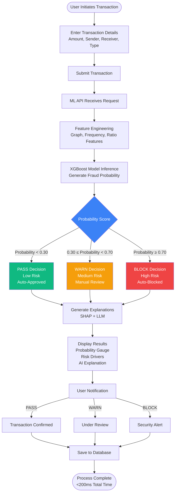
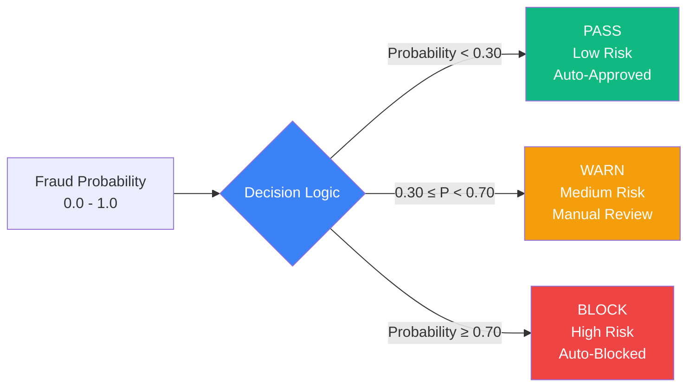

# CloverShield: Solution Description
## Technical Implementation and User Flow

---

## Core Features

### Real-Time Fraud Detection

**Performance**: Sub-200ms response time per transaction

**Process**:
1. **Input**: Raw transaction data
   - Amount, sender/receiver balances
   - Transaction type, timestamps
2. **Feature Engineering**: Transforms data into 15 engineered features
   - Graph metrics (PageRank, in-degree, out-degree)
   - Frequency patterns (transaction counts)
   - Ratio features (amount vs. historical patterns)
   - Temporal features (hour of day)
3. **Model Inference**: XGBoost classifier generates fraud probability (0-1)
4. **Output**: Three-tier decision (PASS/WARN/BLOCK)

**Model Details**:
- Trained on 2.63 million transactions
- Optimized hyperparameters
- Real-time inference capability

### Explainable AI: SHAP and Groq LLM

**Two-Level Explainability**:

1. **SHAP (Technical)**
   - Quantifies feature contributions to fraud probability
   - Returns top 10 features ranked by absolute SHAP value
   - Shows which transaction characteristics drive risk assessment

2. **Groq LLM (User-Facing)**
   - Model: Llama 3.1
   - Generates human-readable explanations in English/Bangla
   - Input: Fraud probability + SHAP contributions + transaction details
   - Output: Plain-language explanations without technical jargon

**Benefits**:
- Users understand why transactions were flagged
- Reduces confusion and support ticket volume
- Helps users take appropriate actions

### Bilingual User Interface

**Languages**: English and Bangla (বাংলা)

**Coverage**:
- Transaction status messages
- Risk explanations
- Error messages
- Analytics dashboard labels
- LLM-generated explanations

**Critical for**: Bangladesh's diverse user base (many prefer Bangla)

---

## User Journey: Transaction Flow

### Step-by-Step Process

#### 1. Transaction Initiation
- **Source**: MFS platform (bKash, Nagad, Upay, Rocket)
- **Payload Includes**:
  - Transaction type (TRANSFER or CASH_OUT)
  - Amount
  - Sender account identifier + balance (before/after)
  - Receiver account identifier + balance (before/after)

#### 2. Risk Analysis
- **Feature Engineering**: Applies pre-computed statistics
  - User transaction history
  - Network graph metrics
- **Model Inference**: Generates fraud probability score
- **Optional Explanations**:
  - SHAP feature contributions
  - LLM-generated human-readable explanation
- **Response Time**: < 200ms
- **Output**:
  - Fraud probability (0.0 to 1.0)
  - Decision (PASS/WARN/BLOCK)
  - Risk level (low/medium/high)
  - Optional explanations

#### 3. Decision: PASS, WARN, or BLOCK

**Decision Tiers**:

| Decision | Probability Range | Action | Use Case |
|----------|------------------|--------|----------|
| **PASS** | < 0.30 | Auto-approved, no intervention | Normal user patterns |
| **WARN** | 0.30 - 0.70 | Manual review required | Suspicious but insufficient evidence |
| **BLOCK** | ≥ 0.70 | Auto-blocked, security alert | Strong fraud indicators |

**Rationale**:
- PASS threshold (0.30): Allows legitimate transactions without friction
- BLOCK threshold (0.70): Stops high-confidence fraud immediately
- WARN tier: Buffer for edge cases requiring human judgment

#### 4. User Notification
- **PASS**: Standard transaction confirmation
- **WARN**: Notification of review status + estimated review time
- **BLOCK**: Immediate notification + security explanation + dispute contact info
- **LLM Explanations**: Human-readable risk assessment in preferred language

---

## Decision Logic: Thresholds and Optimization

### Model Threshold: 0.00754482

**Optimization**:
- **Target**: 99% recall on training dataset
- **Method**: Precision-recall curve analysis on cross-validated predictions
- **Priority**: Minimize false negatives (catch fraud) over reducing false positives

**Why So Low?**
- Extreme class imbalance: 498:1 ratio (legitimate:fraudulent)
- `scale_pos_weight` parameter (498) compensates during training
- Low threshold ensures even low-probability fraud is flagged

### Risk Threshold Mapping

**Two-Level System**:

1. **Binary Detection Threshold**: 0.00754482
   - Flags potentially fraudulent transactions

2. **Operational Risk Thresholds**:
   - **PASS**: Probability < 0.30 (Low risk, proceed with monitoring)
   - **WARN**: 0.30 ≤ Probability < 0.70 (Medium risk, manual review)
   - **BLOCK**: Probability ≥ 0.70 (High risk, auto-block)

**Operational Flexibility**:
- Scores 0.00754482 - 0.30: Flagged but PASS (monitored)
- Scores 0.30 - 0.70: WARN (manual review)
- Scores ≥ 0.70: BLOCK (automatic)

**Threshold Rationale**:
- **0.30 (WARN)**: Reviews moderate risk without overwhelming security teams
- **0.70 (BLOCK)**: Only high-confidence cases trigger blocking (minimizes false positives)

---

## Technical Architecture

### Microservices Design

**Three Main Components**:

1. **Frontend (Next.js)**
   - React-based web application
   - Deployed on Vercel
   - Features: Transaction submission, risk visualization, explanation display
   - Communication: REST endpoints with ML API
   - Storage: Transaction history in Supabase

2. **ML Inference API (FastAPI)**
   - Python microservice for fraud detection
   - Current: Render
   - Planned: Hugging Face Spaces (specialized ML infrastructure)
   - Capabilities:
     - Loads XGBoost model and feature engineer on startup
     - Processes transaction requests
     - Returns predictions with optional explanations
     - Horizontal scaling for high volumes

3. **Database (Supabase/PostgreSQL)**
   - Stores: Transaction history, user authentication, analytics
   - Security: Row-level security policies for data isolation

**Deployment Status**:
- ✅ Frontend: Vercel (production)
- 🔄 ML API: Render (current) → Hugging Face Spaces (planned)
- ✅ Database: Supabase (production)

### Feature Engineering Pipeline

**15 Engineered Features**:

| Category | Features | Description |
|----------|----------|------------|
| **Graph** | PageRank, in-degree, out-degree | Network trust, receiver/sender transaction counts |
| **Frequency** | Transaction counts | Sender and receiver account activity |
| **Ratio** | Amount ratios | Relative to mean/median amounts, account balance |
| **Temporal** | Hour of day | Extracted from transaction timestamp |
| **Type** | Categorical encoding | TRANSFER vs. CASH_OUT |

**Process**:
- **Training**: Feature engineer fitted on historical data (~50,000 rows)
  - Computes user statistics
  - Builds network graph metrics
- **Inference**: Pre-computed statistics applied to new transactions in real-time

---

**Team:** Clover Crew | **Location:** Rajshahi | **Competition:** National AI Build-a-thon 2026 (MXB2026)
