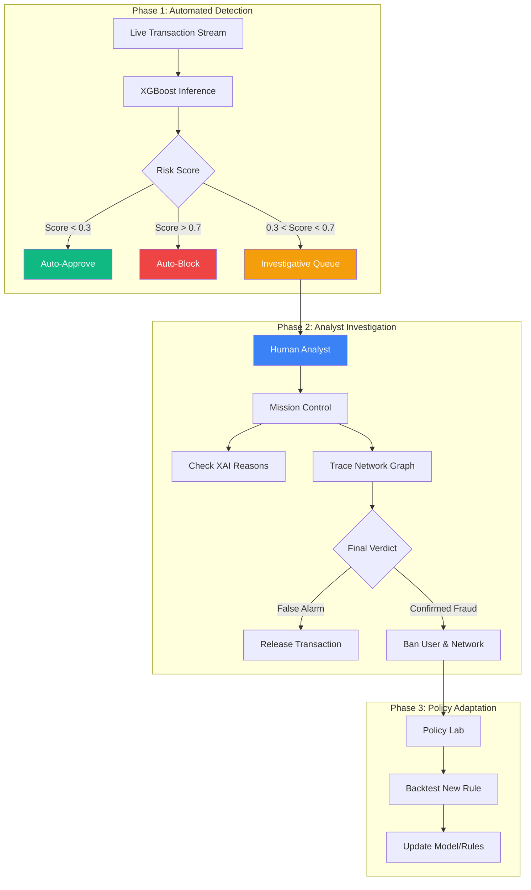
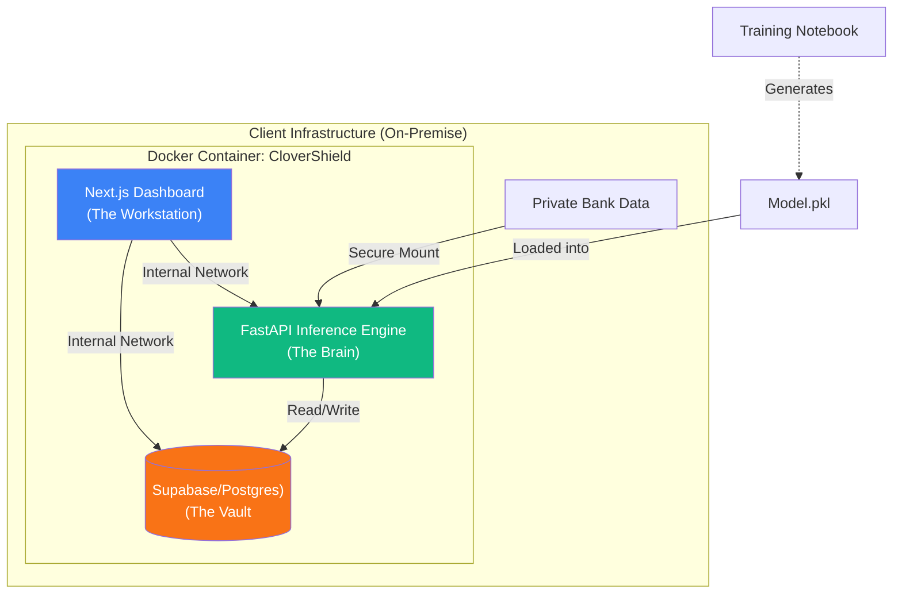

# CloverShield: Solution Description
## The Sovereign Fraud Analyst Workstation

---

## Core Modules

CloverShield transforms the role of a fraud analyst from a "spreadsheet reviewer" to a "cyber-investigator." The solution is divided into four integrated modules:

### 1. Mission Control (The Dashboard)
**The "Heads-Up Display" for Security Operations.**
- **Investigative Queue:** Uses real-time scoring to prioritize high-risk cases. Analysts stop fishing for fraud and start investigating the top 1% of threats.
- **Language Switcher:** Instantly toggles the entire interface and AI explanations between English and Bengali, empowering local analysts.

### 2. The Fraud Scanner (Real-Time XAI)
**The "Engine Room" of Detection.**
- **Sub-200ms Inference:** Powered by an optimized XGBoost model (trained on temporal splits to handle drift).
- **Explainable AI (XAI):** We don't just say "Block." We use **SHAP (SHapley Additive exPlanations)** to visualize exactly *why*—e.g., "This transaction is 500% higher than the user's median."
- **LLM Synthesis:** A local LLM translates these technical math weights into a plain-English (or Bangla) narrative for the analyst.

### 3. Customer 360 (Network Graph)
**The "Syndicate Hunter."**
- **Interactive Graph Visualization:** Fraud doesn't happen in a vacuum. This tool visualizes the money trail.
- **Star Detection:** Instantly spots "mule accounts" (one central node receiving funds from many victims) or "layering" schemes.
- **Graph Neural Features:** Calculates `PageRank` and `Centrality` scores in real-time to detect reputable vs. suspicious nodes.

### 4. The Policy Lab (Rule Sandbox)
**The "Safe Zone" for Strategy.**
- **Backtesting Engine:** Analysts can write new logic (e.g., `amount > 50000 AND hour == 3 AM`) and test it against historical data *before* deployment.
- **Impact Analysis:** Instantly see: "This rule would have caught 500 frauds but blocked 20 legitimate users (False Positives)."
- **Safe Deployment:** Move from "Guesswork" to "Data-Driven Policy."

---

## Analyst Workflow: The Investigation Loop

### Step-by-Step Investigation

1.  **Automated Triage:** The XGBoost model acts as the first line of defense, auto-blocking obvious fraud and auto-approving safe traffic. The "Gray Zone" (medium risk) is sent to the **Investigative Queue**.
2.  **Deep Dive:** The analyst opens a case. They see the **SHAP** score (e.g., "High velocity").
3.  **Network Tracing:** They click the user profile to open the **Network Graph**. They notice the money is immediately flowing to a known high-risk node.
4.  **Action:** The analyst confirms fraud.
5.  **Adaptation:** The analyst goes to the **Policy Lab** to test a rule that would catch similar patterns automatically next time.

---

## Comparative Advantage: Why Sovereign?

| Feature | ☁️ Traditional Cloud SaaS | 🛡️ CloverShield (Sovereign AI) |
| :--- | :--- | :--- |
| **Data Privacy** | ❌ Sends data to foreign servers | ✅ **100% On-Premise** (Dockerized) |
| **Compliance** | ❌ Risks violating Bank Acts | ✅ **Fully Compliant** with BD Law |
| **Latency** | ⚠️ Internet-dependent (>500ms) | ✅ **LAN Speed** (<200ms) |
| **Customization**| ❌ Generic "Global" Models | ✅ **Custom-Trained** on YOUR data |
| **Cost** | 💰 High Monthly Fees (API Calls) | 💵 **Low Flat Cost** (Own Infrastructure) |

---

## Technical Architecture: The "Sovereign Box"

To ensure **Data Sovereignty**, the architecture is strictly containerized.

**Key Components:**

1.  **Frontend (Next.js):** A responsive, dark-mode optimized interface designed for operation centers (SOCs).
2.  **ML API (FastAPI):** Handles 15-feature extraction pipeline and XGBoost inference.
3.  **Local Training Pipeline:** A Jupyter Notebook included in the package allows the bank's data science team to retrain the model on their *real* data without exposing it to us.

---

**Team:** Clover Crew | **Location:** Rajshahi | **Competition:** National AI Build-a-thon 2026 (MXB2026)
