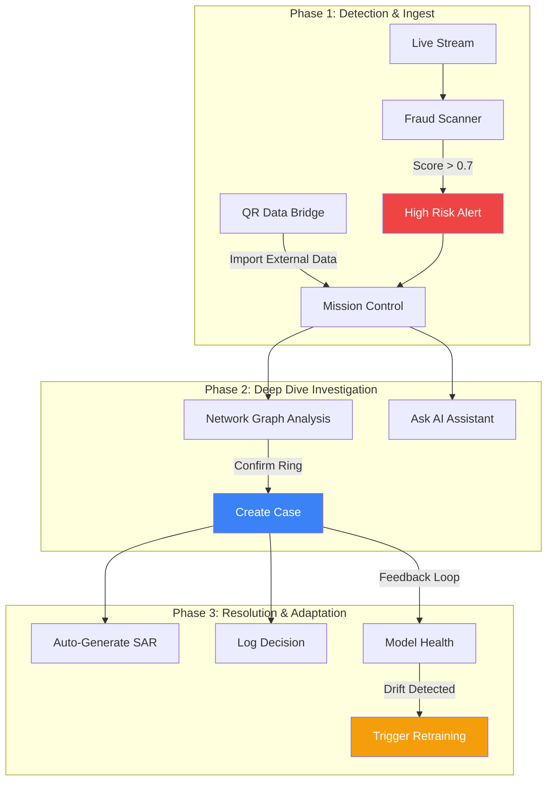
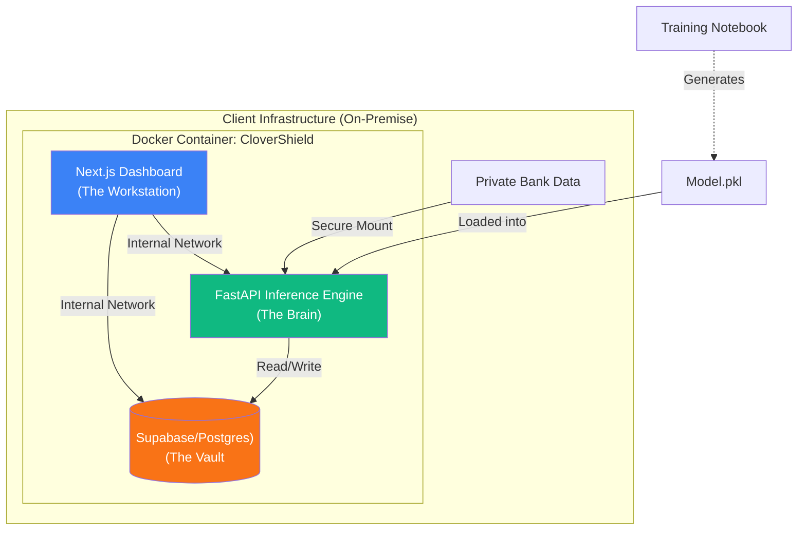

# CloverShield: Solution Description
## The Sovereign Fraud Analyst Workstation

---

## Core Modules

CloverShield transforms the role of a fraud analyst from a "spreadsheet reviewer" to a "cyber-investigator." The solution is divided into four integrated modules:

### 1. Mission Control (The Dashboard)
**The "Heads-Up Display" for Security Operations.**
- **Investigative Queue:** Uses real-time scoring to prioritize high-risk cases. Analysts stop fishing for fraud and start investigating the top 1% of threats.
- **Language Switcher:** Instantly toggles the entire interface and AI explanations between English and Bengali, empowering local analysts.

### 2. The Fraud Scanner (Hybrid Detection Engine)
**The "Engine Room" of Detection.**
- **Hybrid Logic:** Combines the predictive power of **XGBoost** (Black Box) with deterministic **SQL Rules** (White Box). We don't rely solely on AI; if a transaction hits a hard rule (e.g., "Ban all transfers > 1 Lakh at 3 AM"), it is blocked immediately, regardless of the model score.
- **Sub-200ms Inference:** Optimized for high-speed performance.
- **Explainable AI (XAI):** We don't just say "Block." We use **SHAP** to visualize exactly *why*.

### 3. Customer 360 (Network Graph)
**The "Syndicate Hunter."**
- **Interactive Graph Visualization:** Fraud doesn't happen in a vacuum. This tool visualizes the money trail.
- **Star Detection:** Instantly spots "mule accounts" (one central node receiving funds from many victims) or "layering" schemes.
- **Graph Neural Features:** Calculates `PageRank` and `Centrality` scores in real-time to detect reputable vs. suspicious nodes.

### 4. The Policy Lab (Rule Sandbox & Deployer)
**The "Safe Zone" for Strategy.**
- **Backtesting Engine:** Analysts can write new logic and test it against historical data *before* deployment.
- **Active Deployment:** Once a rule is verified, it is pushed to the **Fraud Scanner** as a live filter. This allows analysts to instantly stop new fraud vectors (Zero-Day attacks) without retraining the entire AI model.
- **Safe Deployment:** Move from "Guesswork" to "Data-Driven Policy."

### 5. Advanced Case Management
**The "Digital Dossier" for Investigators.**
- **Investigation Checklists:** Standardized SOPs (e.g., "Verify KYC", "Call Customer") ensure no step is missed during a review.
- **Status Tracking:** Track cases from "Open" to "Under Review" to "Closed" with assigned owners.
- **Quick Actions:** One-click **Freeze/Unfreeze** accounts directly from the case file.
- **Connected Workflow:** Seamlessly jump from an alert to the Graph, then to a Case, and finally to the Policy Lab to patch the vulnerability.

### 6. The Analyst Copilot (AI Chatbot)
**The "24/7 Expert Assistant."**
- **Natural Language Queries:** "Show me all high-risk transfers from the last hour" or "Explain the Smurfing pattern."
- **Context-Aware Help:** The bot understands the current screen (e.g., viewing a specific user) and offers relevant insights.
- **Automated Drafting:** Asks the analyst for key details and drafts a formal investigation report in seconds.

### 7. Compliance & Governance
**The "Regulatory Shield" & "Analyst Watchdog".**
- **Immutable Audit Trail:** Every click, view, export, and decision is logged in Supabase. This monitors the analysts themselves, preventing internal collusion or data theft.
- **SAR Generator:** Automatically generates a "Suspicious Activity Report" (SAR) narrative formatted for the Bangladesh Financial Intelligence Unit (BFIU), summarizing the fraud pattern and evidence.

### 8. Model Health Monitor
**The "AI Pulse Check."**
- **Drift Detection:** Alerts the team if the live transaction patterns start diverging from the training data (e.g., a sudden spike in high-value transfers).
- **Performance Metrics:** Tracks real-time accuracy and latency (<200ms) to guarantee SLA compliance.

### 9. Secure QR Data Bridge
**The "Air-Gap Connector."**
- **Zero-Network Import:** Allows analysts to transfer investigation evidence (e.g., police reports, external bank statements) from a secure tablet to the air-gapped workstation using QR codes.
- **Security:** Ensures no USB drives or internet connections are needed, maintaining the strict "Zero-Trust" environment.

### 10. Code-Free Model Registry
**The "Democratization Engine."**
- **No Python Required:** A fully visual interface where analysts can upload a new CSV dataset, configure training parameters (or use auto-defaults), and launch a retraining job with one click.
- **Version Control:** Automatically versions every model (v1, v2, v3). If a new model performs poorly, rollback to the previous version takes just 5 seconds.
- **Hot-Swapping:** New models go live instantly without restarting the server or dropping a single transaction.

---

## Analyst Workflow: The Connected Ecosystem

The power of CloverShield lies in how these modules talk to each other. It's not a set of tools; it's a unified **Investigation Loop**.

### The "Smooth Workflow" in Action
1.  **Ingest:** Data arrives via live stream or **Secure QR Bridge**.
2.  **Detect:** The **Fraud Scanner** flags a suspicious cluster.
3.  **Investigate:** The analyst uses **Customer 360** and **Copilot** to confirm a money laundering ring.
4.  **Act:** A case is opened, evidence is attached, and a **SAR** is auto-generated.
5.  **Adapt:** The confirmed fraud feeds into the **Model Health** monitor. If accuracy drops, a **Retraining** job is triggered automatically.

---

## Comparative Advantage: Why Sovereign?

| Feature | ☁️ Traditional Cloud SaaS | 🛡️ CloverShield (Sovereign AI) |
| :--- | :--- | :--- |
| **Data Privacy** | ❌ Sends data to foreign servers | ✅ **100% On-Premise** (Dockerized) |
| **Deployment** | ⚠️ Weeks of Integration & VPC Peering | ✅ **One-Command Deploy** (< 5 Mins) |
| **Compliance** | ❌ Risks violating Bank Acts | ✅ **Fully Compliant** with BD Law |
| **Latency** | ⚠️ Internet-dependent (>500ms) | ✅ **LAN Speed** (<200ms) |
| **Customization**| ❌ Generic "Global" Models | ✅ **Custom-Trained** on YOUR data |
| **Cost** | 💰 High Monthly Fees (API Calls) | 💵 **Low Flat Cost** (Own Infrastructure) |

---

## Technical Architecture: The "Sovereign Box"

To ensure **Data Sovereignty**, the architecture is strictly containerized.

**Key Components:**

1.  **Frontend (Next.js):** A responsive, dark-mode optimized interface designed for operation centers (SOCs).
2.  **ML API (FastAPI):** Handles 15-feature extraction pipeline and XGBoost inference.
3.  **Local Training Pipeline:** A Jupyter Notebook included in the package allows the bank's data science team to retrain the model on their *real* data without exposing it to us.

---

**Team:** Clover Crew | **Location:** Rajshahi | **Competition:** National AI Build-a-thon 2026 (MXB2026)
