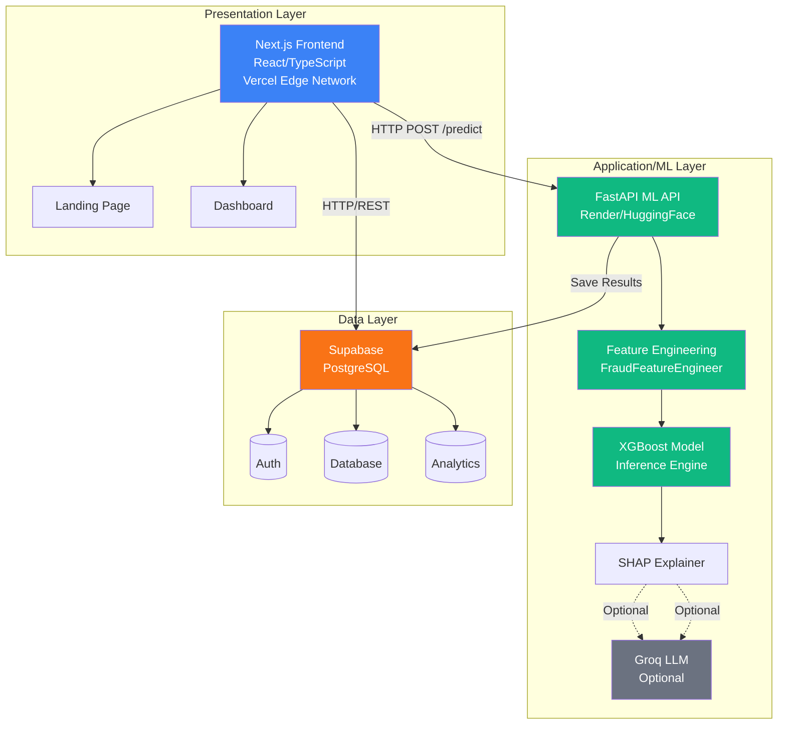
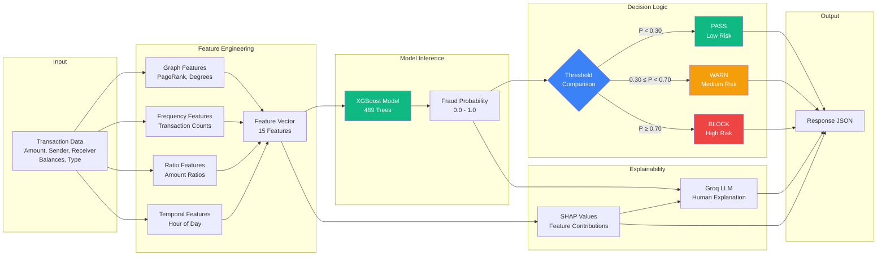
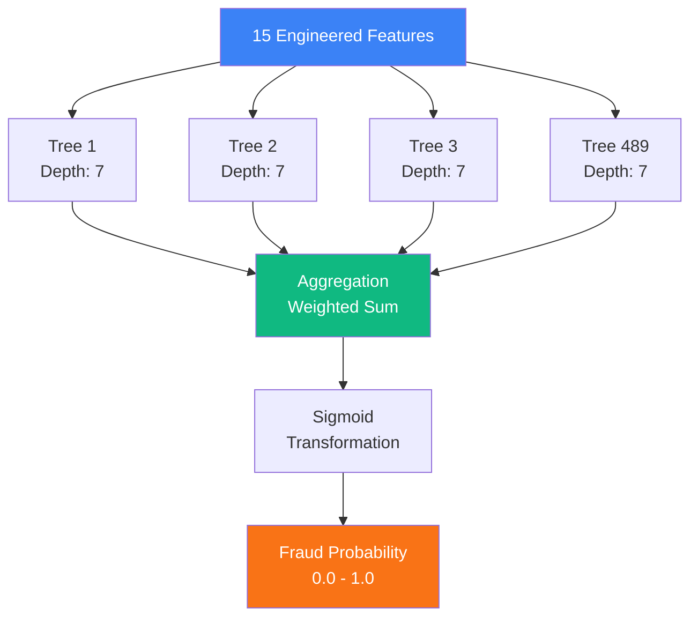

# CloverShield: AI System Architecture
## System Design and Data Flow Documentation

---

## Architecture Overview

CloverShield employs a three-tier microservices architecture designed for scalability, maintainability, and real-time performance. The system separates concerns into distinct layers: presentation (frontend), business logic and ML inference (API), and data persistence (database). This architecture enables independent scaling of components, facilitates deployment across different platforms, and supports horizontal scaling to handle high transaction volumes.

The system processes transactions through a pipeline that transforms raw transaction data into fraud risk assessments in under 200 milliseconds. The architecture supports both synchronous real-time fraud detection and asynchronous batch processing, with optional explainability features that provide transparency into model decisions.

### System Architecture Diagram



---

## System Architecture Diagram Specification

### Diagram Layout

The architecture diagram should be organized in three horizontal layers, with data flow indicated by arrows:

**Top Layer (Presentation):**
- **Next.js Frontend** (React/TypeScript)
  - Components: TransactionForm, DecisionZone, FraudGauge, RiskDrivers, LLMExplanationBox
  - Deployed on: Vercel (Edge Network)
  - Communication: REST API calls to ML API, WebSocket/HTTP to Supabase

**Middle Layer (Application/ML Processing):**
- **FastAPI ML Inference Service**
  - Sub-components:
    - Feature Engineering Module (FraudFeatureEngineer)
    - XGBoost Model Inference Engine
    - SHAP Explanation Generator
    - Groq LLM Integration (optional)
  - Deployed on: Render (current), migrating to Hugging Face Spaces (planned)
  - Communication: Receives HTTP POST requests, returns JSON responses

**Bottom Layer (Data Storage):**
- **Supabase (PostgreSQL)**
  - Tables: transactions, users, analytics
  - Features: Row-level security, real-time subscriptions, authentication
  - Communication: PostgreSQL protocol, REST API for auth

### Data Flow Arrows

1. **User Input Flow:**
   - Frontend → ML API: Transaction data (HTTP POST /predict)
   - Frontend → Supabase: User authentication, transaction history (HTTP/REST)

2. **ML Processing Flow:**
   - ML API → Feature Engineering: Raw transaction → Feature vector
   - Feature Engineering → XGBoost Model: Feature vector → Fraud probability
   - XGBoost Model → Decision Logic: Fraud probability → PASS/WARN/BLOCK decision
   - XGBoost Model → SHAP Explainer: Feature vector + Model → SHAP values
   - SHAP Values + Transaction → Groq LLM: Feature contributions → Human-readable explanation

3. **Response Flow:**
   - ML API → Frontend: Prediction result, SHAP values, LLM explanation (JSON)
   - Supabase → Frontend: Transaction history, user data (JSON)

4. **Storage Flow:**
   - Frontend → Supabase: Save transaction results, analytics data

### Visual Elements

- Use rectangles for components
- Use cylinders for databases
- Use rounded rectangles for sub-modules
- Use dashed lines for optional components (Groq LLM)
- Use different colors:
  - Blue: Frontend components
  - Green: ML/Processing components
  - Orange: Database components
  - Gray: External services (Groq)

---

## Component Descriptions

### 1. Frontend Layer: Next.js Application

**Technology Stack:**
- Next.js 14+ (React framework with App Router)
- TypeScript (type-safe development)
- Tailwind CSS (utility-first styling)
- Zustand (state management)
- Supabase Client (database and authentication)

**Key Components:**

**TransactionForm Component:**
- Captures transaction input from users (amount, sender/receiver, balances, transaction type)
- Validates input data before submission
- Supports bilingual input (English/Bangla)

**DecisionZone Component:**
- Displays fraud risk assessment results
- Shows fraud probability gauge (0-100%)
- Displays decision (PASS/WARN/BLOCK) with color-coded indicators
- Shows risk level (low/medium/high) and confidence score

**FraudGauge Component:**
- Visual gauge displaying fraud probability
- Color-coded: Green (low risk), Yellow (medium risk), Red (high risk)
- Updates in real-time based on prediction results

**RiskDrivers Component:**
- Displays top 10 features contributing to fraud risk (from SHAP values)
- Shows feature names, values, and SHAP contributions
- Sorted by absolute SHAP value (most influential features first)

**LLMExplanationBox Component:**
- Displays human-readable fraud risk explanation (from Groq LLM)
- Supports bilingual explanations (English/Bangla)
- Provides actionable guidance for users

**Deployment:**
- Hosted on Vercel with edge network distribution
- Automatic scaling based on traffic
- Global CDN for low-latency access

### 2. ML Inference API: FastAPI Microservice

**Technology Stack:**
- FastAPI (Python web framework)
- XGBoost (gradient boosting classifier)
- SHAP (model explainability)
- Groq API (LLM explanations)
- Pandas/NumPy (data processing)
- NetworkX (graph analysis)

**Core Modules:**

**Feature Engineering Module (FraudFeatureEngineer):**
- Transforms raw transaction data into 15 engineered features
- Graph features: PageRank (network trust), in-degree, out-degree
- Frequency features: Transaction counts per account
- Ratio features: Amount relative to user's historical patterns
- Temporal features: Hour of day extraction
- Type encoding: Categorical encoding for transaction types
- Uses pre-computed statistics from historical data (fitted on 50k sample)

**XGBoost Model Inference:**
- Loads trained XGBoost classifier (`fraud_pipeline_final.pkl`)
- Model configuration:
  - n_estimators: 489
  - max_depth: 7
  - learning_rate: 0.036
  - scale_pos_weight: 498 (handles class imbalance)
- Generates fraud probability score (0.0 to 1.0)
- Decision threshold: 0.00754482 (optimized for 99% recall)

**SHAP Explanation Generator:**
- Uses TreeExplainer for XGBoost models
- Computes SHAP values for all features
- Returns top 10 features ranked by absolute SHAP value
- Provides feature contribution values (positive = increases fraud risk, negative = decreases fraud risk)

**Groq LLM Integration (Optional):**
- Uses Groq API with Llama 3.1-8b-instant model
- Generates human-readable explanations from SHAP values and transaction details
- Supports bilingual output (English/Bangla)
- Temperature: 0.3 (deterministic explanations)
- Max tokens: 500 (concise explanations)

**API Endpoints:**
- `POST /predict`: Single transaction prediction with optional explanations
- `POST /predict/batch`: Batch prediction for multiple transactions
- `GET /health`: Health check and model status
- `GET /model/info`: Model metadata and configuration

**Deployment:**
- **Current:** Deployed on Render (production environment)
- **Planned Migration:** Hugging Face Spaces (for optimized ML inference and feature engineering performance)
- **Rationale:** Hugging Face Spaces provides specialized infrastructure for ML workloads, offering faster inference times and more efficient feature engineering operations compared to general-purpose cloud platforms
- Supports Docker containerization
- Horizontal scaling support for high transaction volumes
- Lazy model loading for serverless environments

### 3. Database Layer: Supabase (PostgreSQL)

**Technology Stack:**
- PostgreSQL (relational database)
- Supabase (managed PostgreSQL with additional features)
- Row-Level Security (RLS) policies
- Real-time subscriptions

**Database Schema:**

**Transactions Table:**
- Stores transaction history and prediction results
- Columns: transaction_id, user_id, amount, sender, receiver, fraud_probability, decision, risk_level, timestamp
- Indexed on user_id and timestamp for fast queries

**Users Table:**
- Stores user authentication and profile data
- Columns: user_id, email, name, language_preference, created_at
- Integrated with Supabase Auth

**Analytics Table:**
- Stores aggregated analytics data
- Columns: date, total_transactions, fraud_count, avg_fraud_probability, decision_counts
- Used for dashboard visualizations

**Features:**
- Row-Level Security: Users can only access their own transaction data
- Real-time subscriptions: Frontend receives updates when new transactions are added
- Authentication: Built-in user authentication and session management
- Automatic backups and point-in-time recovery

**Deployment:**
- Managed PostgreSQL on Supabase cloud
- Automatic scaling and backups
- Global edge network for low-latency access

---

## Data Flow: Transaction Processing Pipeline

### Complete Data Flow Diagram



### Stage 1: Transaction Input

**Input Data Structure:**
```json
{
  "step": 1,
  "type": "TRANSFER" | "CASH_OUT",
  "amount": 1000.00,
  "nameOrig": "C1234567890",
  "oldBalanceOrig": 5000.00,
  "newBalanceOrig": 4000.00,
  "nameDest": "M9876543210",
  "oldBalanceDest": 2000.00,
  "newBalanceDest": 3000.00
}
```

**Source:** User submits transaction through Frontend TransactionForm component.

**Destination:** Frontend sends HTTP POST request to ML API `/predict` endpoint with transaction data.

### Stage 2: Feature Engineering (Preprocessing)

**Process:**
1. **Graph Feature Extraction:**
   - Lookup sender's PageRank score from pre-computed network graph
   - Lookup sender's out-degree (number of outgoing transactions)
   - Lookup receiver's in-degree (number of incoming transactions)
   - Default to 0.0 if account not found in graph

2. **Frequency Feature Extraction:**
   - Lookup sender's transaction count from pre-computed statistics
   - Lookup receiver's transaction count from pre-computed statistics
   - Default to 0 if account not found

3. **Ratio Feature Calculation:**
   - Calculate amount ratio to sender's mean transaction amount
   - Calculate amount ratio to sender's median transaction amount
   - Calculate amount ratio to sender's account balance
   - Apply log transformations for skewed distributions

4. **Temporal Feature Extraction:**
   - Extract hour of day from transaction timestamp (step % 24)

5. **Type Encoding:**
   - Encode transaction type: TRANSFER → 0, CASH_OUT → 1

**Output:** Feature vector with 15 numeric features:
- `hour`: Hour of day (0-23)
- `orig_txn_count`: Sender transaction count
- `dest_txn_count`: Receiver transaction count
- `amt_ratio_to_user_mean`: Amount / user mean amount
- `amt_ratio_to_user_median`: Amount / user median amount
- `amt_log_ratio_to_user_median`: Log(amount) / log(user median)
- `amount_log1p`: Log(1 + amount)
- `amount_over_oldBalanceOrig`: Amount / sender balance
- `in_degree`: Receiver in-degree
- `out_degree`: Sender out-degree
- `network_trust`: Sender PageRank score
- `is_new_origin`: Binary flag (1 if new sender)
- `is_new_dest`: Binary flag (1 if new receiver)
- `type_encoded`: Transaction type (0 or 1)

**Processing Time:** <50ms (feature engineering is vectorized and uses pre-computed lookups)

### Stage 3: Model Inference (XGBoost)

**Process:**
1. Feature vector is passed to XGBoost classifier
2. Model applies 489 decision trees (n_estimators) with max depth 7
3. Each tree evaluates the feature vector and produces a probability contribution
4. Contributions are aggregated across all trees
5. Final fraud probability score is computed (sigmoid transformation)

**Model Details:**
- **Algorithm:** Gradient Boosting (XGBoost)
- **Hyperparameters:**
  - n_estimators: 489
  - max_depth: 7
  - learning_rate: 0.036
  - subsample: 0.727
  - colsample_bytree: 0.760
  - scale_pos_weight: 498 (handles 498:1 class imbalance)
- **Training Data:** 2.63M transactions, 5,275 fraud cases
- **Decision Threshold:** 0.00754482 (optimized for 99% recall)

**Output:** Fraud probability score (float, 0.0 to 1.0)

**Processing Time:** <100ms (XGBoost inference is highly optimized)

### Stage 4: Decision Logic

**Process:**
1. Fraud probability score is compared against risk thresholds:
   - If probability < 0.30: Decision = PASS, Risk Level = LOW
   - If 0.30 ≤ probability < 0.70: Decision = WARN, Risk Level = MEDIUM
   - If probability ≥ 0.70: Decision = BLOCK, Risk Level = HIGH

2. Confidence score is calculated based on probability:
   - High confidence (0.9): probability < 0.1 or > 0.9
   - Medium-high confidence (0.75): probability < 0.2 or > 0.8
   - Medium confidence (0.6): probability < 0.3 or > 0.7
   - Low confidence (0.4): otherwise

**Output:** Decision (PASS/WARN/BLOCK), Risk Level (LOW/MEDIUM/HIGH), Confidence (0.0-1.0)

**Processing Time:** <1ms (simple threshold comparisons)

### Stage 5: Explainability (Optional)

**SHAP Explanation Generation:**
1. SHAP TreeExplainer computes feature contributions
2. For each feature, calculates how much it increases or decreases fraud probability
3. Features are ranked by absolute SHAP value
4. Top 10 features are returned with their contributions

**Output:** List of features with:
- Feature name
- Feature value
- SHAP contribution (positive = increases risk, negative = decreases risk)
- Absolute SHAP value (for ranking)

**Processing Time:** <50ms (SHAP computation is optimized for tree models)

**Groq LLM Explanation Generation (Optional):**
1. SHAP values, fraud probability, and transaction details are formatted into a prompt
2. Prompt is sent to Groq API with Llama 3.1-8b-instant model
3. LLM generates human-readable explanation in requested language (English/Bangla)
4. Explanation avoids technical jargon and focuses on user-actionable insights

**Output:** Human-readable text explanation (string, ~200-500 tokens)

**Processing Time:** <100ms (Groq API response time)

### Stage 6: Response Assembly

**Process:**
1. All components (probability, decision, SHAP values, LLM explanation) are assembled into JSON response
2. Processing time is calculated (total elapsed time)
3. Transaction ID is generated (UUID)
4. Timestamp is added (ISO 8601 format)

**Output:** JSON response:
```json
{
  "transaction_id": "uuid",
  "prediction": {
    "fraud_probability": 0.45,
    "decision": "warn",
    "risk_level": "medium",
    "confidence": 0.6
  },
  "shap_explanations": [
    {
      "feature": "amt_ratio_to_user_median",
      "value": 5.2,
      "shap": 0.15,
      "shap_abs": 0.15,
      "rank": 1
    },
    ...
  ],
  "llm_explanation": {
    "text": "This transaction shows some unusual patterns...",
    "language": "en"
  },
  "processing_time_ms": 187,
  "model_version": "1.0.0",
  "timestamp": "2026-01-20T10:30:45Z"
}
```

**Total Processing Time:** <200ms (target: under 200ms for real-time processing)

### Stage 7: Frontend Display

**Process:**
1. Frontend receives JSON response from ML API
2. DecisionZone component displays fraud probability gauge and decision
3. RiskDrivers component displays top SHAP features
4. LLMExplanationBox component displays human-readable explanation (if available)
5. Transaction result is saved to Supabase for history and analytics

**User Experience:**
- Real-time visual feedback (<200ms from submission to display)
- Color-coded risk indicators (green/yellow/red)
- Interactive feature exploration (click to see SHAP details)
- Bilingual interface (English/Bangla toggle)

---

## Model Architecture: XGBoost Classifier

### Model Type and Algorithm

**Algorithm:** Extreme Gradient Boosting (XGBoost)
- Ensemble method combining multiple decision trees
- Sequential training where each tree corrects errors from previous trees
- Gradient boosting optimization minimizes loss function

### Model Structure



**Tree Ensemble:**
- 489 decision trees (n_estimators)
- Each tree has maximum depth of 7 levels
- Trees are trained sequentially with learning rate 0.036
- Subsampling: 72.7% of training data per tree (subsample: 0.727)
- Feature subsampling: 76.0% of features per tree (colsample_bytree: 0.760)

**Input Features:** 15 engineered features (from feature engineering stage)

**Output:** Fraud probability score (0.0 to 1.0) via sigmoid transformation

### Training Configuration

**Class Imbalance Handling:**
- scale_pos_weight: 498 (fraud class weight is 498x legitimate class)
- Reflects 498:1 ratio of legitimate to fraudulent transactions in training data
- Ensures model learns to detect rare fraud cases

**Optimization:**
- Loss function: Binary logistic loss
- Regularization: L1 and L2 regularization built into XGBoost
- Hyperparameter tuning: RandomizedSearchCV with 3-fold cross-validation
- Scoring metric: Average Precision (optimized for imbalanced data)

**Decision Threshold:**
- Threshold: 0.00754482
- Optimized for 99% recall (minimize false negatives)
- Determined via precision-recall curve on cross-validated predictions

### Model Performance

**Test Set Metrics (137,779 transactions):**
- Accuracy: 100%
- Recall: 100% (all fraud cases detected)
- Precision: 91% (low false positive rate)
- F1-Score: 0.95
- False Positive Rate: 0.22%

**Confusion Matrix:**
- True Negatives: 134,543
- False Positives: 298
- False Negatives: 0
- True Positives: 2,938

---

## Explainability Architecture

### SHAP (SHapley Additive exPlanations)

**Purpose:** Quantify feature contributions to fraud probability score

**Method:**
- Uses TreeExplainer optimized for tree-based models (XGBoost)
- Computes SHAP values for all 15 features
- SHAP values sum to the difference between model output and baseline (expected value)

**Output Format:**
- Feature name, feature value, SHAP contribution, absolute SHAP value
- Positive SHAP value: feature increases fraud risk
- Negative SHAP value: feature decreases fraud risk
- Features ranked by absolute SHAP value (most influential first)

**Use Cases:**
- Technical users: Understand which transaction characteristics drive fraud detection
- Compliance teams: Audit model decisions and identify fraud patterns
- Model debugging: Identify features that contribute unexpectedly to predictions

### Groq LLM Explanations

**Purpose:** Generate human-readable explanations for non-technical users

**Method:**
- Uses Groq API with Llama 3.1-8b-instant model
- Receives fraud probability, SHAP feature contributions, and transaction details
- Generates plain-language explanation avoiding technical terms
- Supports bilingual output (English/Bangla)

**Prompt Engineering:**
- System prompt instructs LLM to avoid technical jargon
- Focuses on user-actionable insights (red flags, what to be cautious about)
- Temperature: 0.3 (deterministic, consistent explanations)
- Max tokens: 500 (concise explanations)

**Output Format:**
- Human-readable text explanation
- Language: English or Bangla (based on user preference)
- Content: Transaction risk assessment, red flags, recommended actions

**Use Cases:**
- End users: Understand why their transaction was flagged
- Customer support: Explain fraud decisions to users
- Transparency: Build trust through explainable AI

---

## System Integration and Communication

### Frontend ↔ ML API Communication

**Protocol:** HTTP REST API
**Format:** JSON
**Endpoints:**
- `POST /predict`: Single transaction prediction
- `POST /predict/batch`: Batch prediction
- `GET /health`: Health check

**Request Example:**
```json
POST /predict
{
  "transaction": {
    "step": 1,
    "type": "TRANSFER",
    "amount": 1000.00,
    "nameOrig": "C1234567890",
    "oldBalanceOrig": 5000.00,
    "newBalanceOrig": 4000.00,
    "nameDest": "M9876543210",
    "oldBalanceDest": 2000.00,
    "newBalanceDest": 3000.00
  },
  "options": {
    "include_shap": true,
    "include_llm_explanation": true,
    "language": "en",
    "topk": 10
  }
}
```

**Response Example:**
```json
{
  "transaction_id": "uuid",
  "prediction": {...},
  "shap_explanations": [...],
  "llm_explanation": {...},
  "processing_time_ms": 187,
  "model_version": "1.0.0",
  "timestamp": "2026-01-20T10:30:45Z"
}
```

### Frontend ↔ Supabase Communication

**Protocol:** HTTP REST API (Supabase Client)
**Format:** JSON
**Operations:**
- Authentication: User login/signup
- Transaction storage: Save prediction results
- Transaction retrieval: Load transaction history
- Real-time subscriptions: Receive updates on new transactions

### ML API ↔ Groq API Communication

**Protocol:** HTTP REST API
**Format:** JSON
**Endpoint:** Groq Chat Completions API
**Model:** llama-3.1-8b-instant
**Authentication:** API key (environment variable)

---

## Scalability and Performance

### Horizontal Scaling

**Frontend:**
- Vercel automatically scales based on traffic
- Edge network distribution reduces latency globally
- Stateless design enables unlimited scaling

**ML API:**
- **Current:** Stateless design deployed on Render (model loaded per instance)
- **Planned:** Migration to Hugging Face Spaces for optimized ML inference performance
- Hugging Face Spaces provides specialized ML infrastructure with faster inference times and more efficient feature engineering operations
- Can deploy multiple instances behind load balancer
- Each instance handles requests independently
- Model loading: ~10-30 seconds on cold start (lazy loading supported), expected to improve with Hugging Face Spaces infrastructure

**Database:**
- Supabase PostgreSQL supports read replicas
- Connection pooling for high concurrency
- Automatic scaling based on usage

### Performance Optimization

**Feature Engineering:**
- Pre-computed statistics (user means, graph metrics) reduce computation
- Vectorized operations (NumPy/Pandas) for fast processing
- Memory-efficient graph operations (PageRank limit: 10k nodes)

**Model Inference:**
- XGBoost optimized C++ implementation
- Batch prediction support for multiple transactions
- Model caching in memory (loaded once per API instance)

**API Response:**
- Async processing for optional LLM explanations
- Parallel SHAP computation and LLM generation
- Response compression (gzip) for large payloads

### Performance Targets

- **Latency:** <200ms per transaction (p95)
- **Throughput:** 1000+ transactions per second (with horizontal scaling)
- **Availability:** 99.9% uptime (with redundancy)

---

**Team:** Clover Crew | **Location:** Rajshahi | **Competition:** National AI Build-a-thon 2026 (MXB2026)

