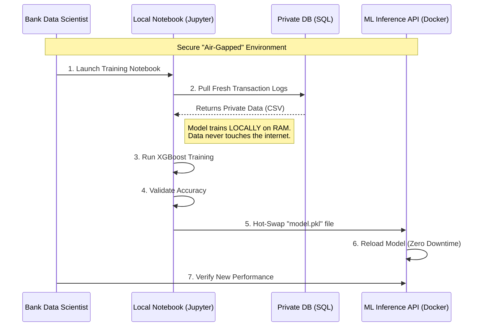

# CloverShield: AI System Architecture
## The Sovereign AI Deployment Model

---

## Architecture Overview: Bringing AI to the Data

CloverShield is built on a **Sovereign AI Architecture**. Most AI solutions require data to be sent to a central cloud for processing. CloverShield reverses this: we provide a pre-built, Dockerized workstation that is deployed within the bank's own secure infrastructure. This ensures that sensitive customer data never leaves the institution's control, strictly adhering to Bangladesh's data privacy laws.

### The Sovereign Architecture Diagram

```mermaid
graph TB
    subgraph "Development Zone (Clover Crew)"
        SYN[Synthetic Dataset<br/>PaySim] --> NB[Training Notebook]
        NB --> BASE[Base Model v1.0]
    end

    subgraph "Sovereign Zone (On-Premise Bank Server)"
        subgraph "Docker Orchestration"
            API[ML Inference API<br/>FastAPI]
            UI[Analyst Workstation<br/>Next.js]
            DB[(Local DB)<br/>Postgres]
            
            UI <--> API
            API <--> DB
        end
        
        PRIV[Private Bank Data] -->|Retrain Trigger| API
        BASE -->|Fine-tuned with| PRIV
    end
    
    style SYN fill:#e1f5fe
    style BASE fill:#10b981,color:#fff
    style API fill:#10b981,color:#fff
    style UI fill:#3b82f6,color:#fff
    style PRIV fill:#ef4444,color:#fff
```

---

## The Private Retraining Workflow
This sequence shows how a bank updates the AI model without the Clover Crew team ever seeing the data.



---

## Component Deep Dive

### 1. The Inference Engine (FastAPI)
- **Role:** The high-performance core that handles real-time scoring.
- **Sovereign Feature:** The API is designed to be **Stateless**. It can be deployed in an "Air-Gapped" environment (no internet access) because all model weights and feature engineering logic are bundled within the Docker image.
- **Latency:** Optimized for <200ms processing to ensure zero friction in high-volume mobile banking.

### 2. The Analyst Workstation (Next.js)
- **Role:** The primary interface for human fraud officers.
- **Capability:** Includes the **Policy Lab**, allowing analysts to write SQL-like rules and backtest them against local Postgres transaction logs.
- **Localization:** Integrated i18n support for English and Bangla.

### 3. The Feature Engineering Pipeline
The system transforms raw transaction logs into 15 "Sovereign Features" without external lookups:
- **Graph Features:** Calculates PageRank and In/Out degree metrics on the local transaction graph to detect syndicate "star" networks.
- **Temporal Features:** Detects "Midnight Raids" (high-velocity transfers at odd hours).
- **Behavioral Ratios:** Compares current transaction amount against the user's historical median stored in the local DB.

### 4. The Retraining Pipeline (Jupyter)
- **Role:** We provide a standardized training notebook.
- **Process:** Bank data scientists can run this notebook against their **real private data** to create a "CloverShield Fine-tuned Model."
- **Privacy:** Since the notebook runs on the bank's local server, the Clover Crew team never sees the real data, yet the bank gets a model optimized for their specific regional fraud patterns.

---

## The Explainability Layer (XAI)

CloverShield solves the "Black Box" problem using a tiered explainability stack:

1.  **Global Interpretability:** High-level feature importance across the entire dataset.
2.  **Local Interpretability (SHAP):** For every single blocked transaction, the system calculates **SHAP values**. This tells the analyst exactly which features (e.g., "Account Age" or "Transaction Amount") pushed the risk score over the limit.
3.  **Human Synthesis (LLM):** A local LLM takes the SHAP numbers and generates a summary: *"This was blocked because the recipient is a new account created 2 hours ago and is receiving 10x the usual amount."*

---

## Security & Scalability

- **Horizontal Scaling:** Because the ML API is Dockerized, the bank can spin up 10+ containers to handle peak loads (e.g., during Eid or salary days) using Kubernetes.
- **Data Residency:** 100% compliant. No data leaves the bank's VPC.
- **Authentication:** Integrated with Supabase/Postgres for Row-Level Security, ensuring analysts only see transactions within their assigned region or branch.

---

**Team:** Clover Crew | **Location:** Rajshahi | **Competition:** National AI Build-a-thon 2026 (MXB2026)
