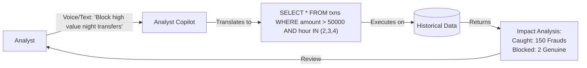

# CloverShield: Prompts and AI Process
## AI Reasoning in Sovereign System Design

---

## 1. Designing for Privacy-First Constraints

The core challenge was building a high-performance AI system for banks without *access* to banking data. We used AI reasoning to architect a "Zero-Trust" solution.

### Prompt Strategy: The "Sovereign" Constraint
**Goal:** Design an architecture where the vendor (us) never touches the data.

> **Prompt:** "Design a fraud detection system deployment strategy for highly regulated financial institutions in Bangladesh where data cannot leave the premise. The solution must allow the vendor to update the model architecture without seeing the retraining data."

**AI-Generated Insight:**
- **The "Model Template" Approach:** Instead of shipping a trained model, ship the *training code* (Notebook).
- **The Docker Solution:** Package the entire application as a "Black Box" container that banks can run internally.
- **Synthetic Proxy:** Use PaySim (synthetic data) as a structural proxy for development, ensuring code compatibility with real banking schemas.

---

## 2. Generating Synthetic "Syndicate" Data

To test our **Network Graph** and **Policy Lab**, we needed complex fraud patterns (money laundering rings) that simple datasets don't have. We used LLMs to write scripts that "injected" specific fraud topologies into our synthetic data.

> **Prompt:** "Write a Python script using NetworkX to inject a 'Star Topology' fraud ring into a CSV dataset. Create one central 'mule' account that receives small transfers from 50 different accounts within a 1-hour window, followed by a large cash-out."

**Outcome:**
- This allowed us to validate that our **Graph Neural Features** (PageRank/Degree) would correctly flag these "mule" accounts even if the individual transfer amounts were small (a common evasion tactic).

---

## 3. The "Analyst Copilot" (Policy Lab)

We integrated AI directly into the **Policy Lab** to help non-technical analysts write SQL-like fraud rules.

### The "Text-to-Rule" Engine
**Goal:** Allow an analyst to describe a fraud pattern in English/Bangla and convert it to executable logic.

> **System Prompt (Internal):** "You are a fraud policy expert. Convert the user's natural language description into a Python boolean expression compatible with Pandas DataFrame filtering.
>
> **User Input:** 'Flag any transaction over 50k occurring between 2 AM and 4 AM.'
> **AI Output:** `(df['amount'] > 50000) & (df['hour'] >= 2) & (df['hour'] <= 4)`"

### AI Workflow: From Thought to Policy

**Impact:**
- This feature democratizes fraud prevention. A senior analyst who understands criminal behavior but not coding can now deploy sophisticated rule-sets in the **Policy Lab** sandbox.

---

## 4. XAI Narrative Generation

Finally, we used prompt engineering to humanize the **SHAP** explanations for the dashboard.

> **Prompt:** "You are a senior security analyst. Translate these SHAP values into a concise investigation lead for a junior officer.
>
> **Input:** `Top Feature: dist_mean_ratio = 5.2`, `Second Feature: is_new_receiver = True`
> **Output:** 'Investigate this transfer. The amount is 5.2x higher than the user's average, and it is being sent to a completely new recipient.'"

**Outcome:**
- This reduces the "Cognitive Load" on analysts, allowing them to make faster decisions without interpreting raw feature importance graphs.

---

## 5. The Analyst Copilot (Expert Knowledge Base)

The Copilot was upgraded from a generic assistant to a **Sovereign Expert** by injecting the entire project documentation into its persistent memory.

### Knowledge Base Injection
We centralized the "Knowledge Base" (User Guide, Solution Architecture, Fraud Patterns) into a unified system prompt. This ensures the bot always provides answers consistent with the platform's actual capabilities.

### Semantic Page Context
The chatbot is "Context-Aware"—it knows exactly which screen the analyst is currently viewing and why.

**The Semantic Mapping Logic:**
Instead of sending raw URLs, the frontend translates the path into a **User Intent** description:
-   `/dashboard/graph` → *"Network Graph. User is visualizing connections between accounts to find fraud rings."*
-   `/dashboard/policy` → *"Policy Lab. User is creating or backtesting fraud detection rules."*

**The "Expert" System Prompt (Extract):**
> "You are CloverShield, an expert AI Fraud Analyst Assistant.
>
> **PROJECT KNOWLEDGE BASE:**
> - **Module Awareness:** In-depth knowledge of Policy Lab (SQL syntax), Secure QR Import, and Customer 360 (Star Patterns).
> - **Fraud Domain:** Expert on Smurfing, Structuring, and Velocity Attacks.
> - **Instructions:** Use the provided 'Current Context' to tailor your answer. Explain *how* to use features based on the Analyst Guide. Do NOT use Markdown formatting."

**Outcome:**
- Analysts receive immediate, expert-level support without leaving the workstation, even in air-gapped environments where external documentation is unavailable.
- The "Reset Chat" feature ensures clean investigation sessions for different cases.

---

## 6. Automated SAR Generation

To streamline compliance, we engineered a prompt to convert raw case data into a formal legal document.

**Goal:** Generate a BFIU-compliant "Suspicious Activity Report" (SAR) narrative.

> **Prompt:** "You are a Senior Financial Crime Investigator. Write the 'Narrative' section of a SAR for the following case.
>
> **Case Data:** Total Volume: 500,000 BDT. Transaction Types: CASH_OUT.
> **Analyst Notes:** 'User received multiple small transfers then cashed out immediately.'
>
> **Instructions:**
> 1. Include sections: RISK INDICATORS, BEHAVIORAL PATTERN ANALYSIS, RECOMMENDED ACTIONS.
> 2. Use UPPERCASE for headers.
> 3. Tone: Objective and regulatory-focused."

**Outcome:**
- Reduces report writing time from 30 minutes to 5 seconds per case.

---

## 7. Deployment Strategy & Task Pipeline Generation

To ensure the "Black Box" Sovereign Workstation met the strict security and operational requirements of MFS providers, we used AI to break down the complex deployment goal into a precise, execution-ready task pipeline.

### AI-Generated Strategic Plan
**Goal:** Create a "Black Box" B2B Fraud Detection Dashboard for Bangladeshi MFS providers that is privacy-safe, localized, and easy to deploy.

> **Prompt:** "Generate a step-by-step task pipeline to convert a prototype fraud model into a Dockerized 'Black Box' product for enterprise deployment. Focus on UI localization, real-time simulation using historical CSVs, and a 'single-command' setup experience."

### Resulting Task Pipeline

#### **ID: [01] Containerize Full Stack & Unify Docker Environment**
**Phase:** Preparation
**Objective:** Create a root-level `docker-compose.yml` to orchestrate the entire solution as a single deliverable "Black Box."
- **Actions:** Define services for `ml-api` (FastAPI) and `frontend` (Next.js). Configure shared internal networks and environment variables (`NEXT_PUBLIC_API_URL`) so the user only needs `docker-compose up`.
- **Outcome:** A functional system launchable with one command.

#### **ID: [02] Develop Transaction Replay & Simulation Engine**
**Phase:** Research & Planning
**Objective:** Implement "Live Stream" logic within the backend to simulate real-time traffic from historical CSV data.
- **Actions:** Create `GET /simulate/stream` endpoint. Implement a background generator to read `test_dataset.csv` row-by-row. Add state controls (Play/Pause/Speed).
- **Outcome:** A streaming engine that mimics live transaction feeds for the analyst dashboard.

#### **ID: [03] Implement "Localized Cyber-Security" UI Theme**
**Phase:** Planning & Design
**Objective:** Overhaul the Frontend styling to match the "Dark Mode + Local MFS Colors" aesthetic.
- **Actions:** Configure Tailwind for dark mode with neon accents (Green/Red). Create a "Brand Theme Toggle" (bKash Pink / Nagad Orange). Design "Security HUD" style cards.
- **Outcome:** A professional, localized interface that feels native to Bangladeshi security operations centers.

#### **ID: [04] Build Live Network Graph Visualization**
**Phase:** Execution
**Objective:** Develop the "HQ Analyst" view for visualizing fraud rings in real-time.
- **Actions:** Integrate `react-force-graph`. Listen to the simulation stream. Dynamically add nodes/edges. Color-code edges by fraud probability. Cluster nodes to reveal "mule" networks.
- **Outcome:** A real-time, interactive map of money flow.

#### **ID: [05] Integrate Hybrid Simulation Controls**
**Phase:** Execution
**Objective:** Connect the backend Replay Engine to the Frontend UI for a seamless demo experience.
- **Actions:** Build a control panel (Auto-Play, Speed Slider). Integrate manual transaction entry. Ensure both stream and manual data feed into the same graph and activity log.
- **Outcome:** An interactive dashboard allowing both passive monitoring and active testing.

#### **ID: [06] Finalize Bilingual Analytics & Deliverable Polish**
**Phase:** Review
**Objective:** Ensure the product is enterprise-ready.
- **Actions:** Verify `LanguageToggle` coverage for new features. Validate ROI metrics. Write a `DEPLOYMENT_README.md` for IT teams explaining how to load private datasets.
- **Outcome:** A polished, fully documented "Sovereign AI" package ready for client handover.

---

**Team:** Clover Crew | **Location:** Rajshahi | **Competition:** National AI Build-a-thon 2026 (MXB2026)