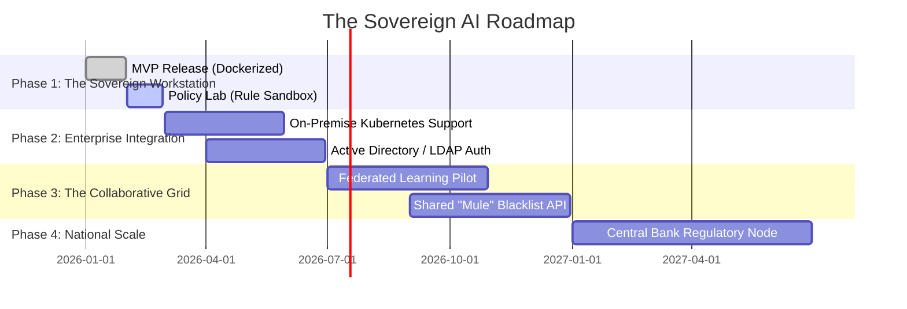
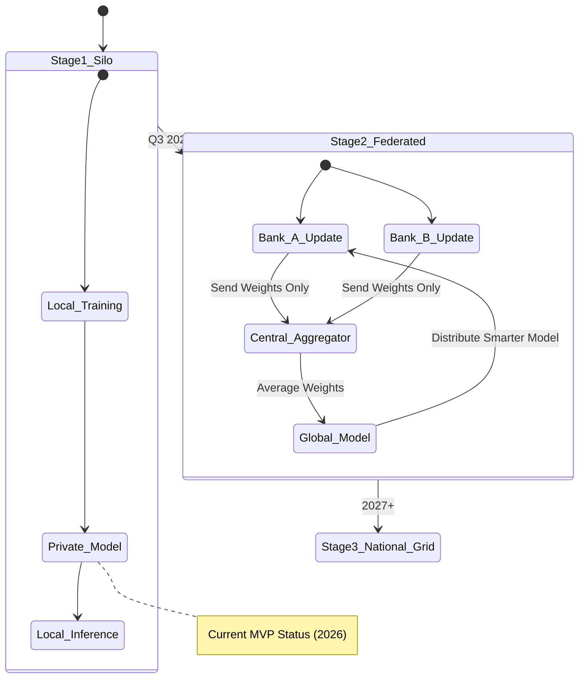

# CloverShield: Product Roadmap
## From Sovereign Workstation to National Defense Grid

---

## Executive Summary

CloverShield is currently a **standalone sovereign workstation**. Our roadmap focuses on evolving this into a **connected defense ecosystem** that allows banks to collaborate on fraud prevention without ever exposing their private customer data.

### Roadmap Timeline

---

## Technical Evolution: The Maturity Model

We view the evolution of CloverShield in three distinct technical stages, moving from isolation to secure collaboration.

---

## Phase 1: The Sovereign Workstation (Current - Q1 2026)
**Goal:** Perfect the single-node experience for individual analysts.

-   **Zero-Trust Docker Kit:** Ensure the `docker-compose up` experience is flawless on air-gapped servers.
-   **The Policy Lab:** Finalize the "Backtesting Engine" that allows analysts to simulate rule changes on historical data without affecting live traffic.
-   **Bilingual 2.0:** Expand Bengali support to cover deep technical explanations in the XAI module.

## Phase 2: Enterprise Integration (Q2 2026)
**Goal:** Fit seamlessly into existing Bank IT infrastructure.

-   **Kubernetes (K8s) Helm Charts:** Move beyond Docker Compose. Provide Helm charts for banks to deploy CloverShield on their internal OpenShift or K8s clusters for high availability (HA).
-   **LDAP/SSO Integration:** allow analysts to log in using their corporate Bank credentials instead of a separate account.
-   **Audit Logging:** Immutable logs of every analyst action (who viewed which transaction) for internal compliance.

## Phase 3: The Collaborative Grid (Q3-Q4 2026)
**Goal:** Solve the "Silo Problem" without breaking privacy.

### The "Federated Learning" Initiative
Currently, Bank A doesn't know about a new fraud pattern attacking Bank B.
-   **Solution:** We will implement **Federated Learning**.
-   **How:** CloverShield instances at Bank A and Bank B will locally train a "weight update" (not data). These mathematical updates are sent to a central server to improve the global model.
-   **Result:** Bank A gets smarter from Bank B's attacks without ever seeing Bank B's customer data.

### Shared "Mule" Blacklist
-   Create a privacy-preserving "Hash API" where banks can check if a destination account (hashed) has been flagged as a "Mule" by another institution.

## Phase 4: National Scale (2027+)
**Goal:** Regulatory oversight and national economic protection.

-   **The "Regulator Node":** A special version of CloverShield for the Central Bank (Bangladesh Bank) to monitor *aggregate* fraud levels and systemic risk across the economy without inspecting individual citizen transactions.
-   **Real-Time Economic Defense:** Automated circuit breakers that can pause specific transaction types sector-wide during massive coordinated cyber-attacks.

---

## Scalability Narrative: From 1 to 100 Million

Our "Dockerized" approach is not just for privacy; it is the key to infinite scale.

1.  **Unit Scale:** A single container handles ~200 TPS (Transactions Per Second).
2.  **Branch Scale:** A bank needs 2,000 TPS. They simply spin up 10 stateless API containers behind their internal Load Balancer.
3.  **National Scale:** Because the data stays local, we don't need a massive central supercomputer. The processing power is distributed across the entire banking sector's existing infrastructure.

---

**Team:** Clover Crew | **Location:** Rajshahi | **Competition:** National AI Build-a-thon 2026 (MXB2026)
