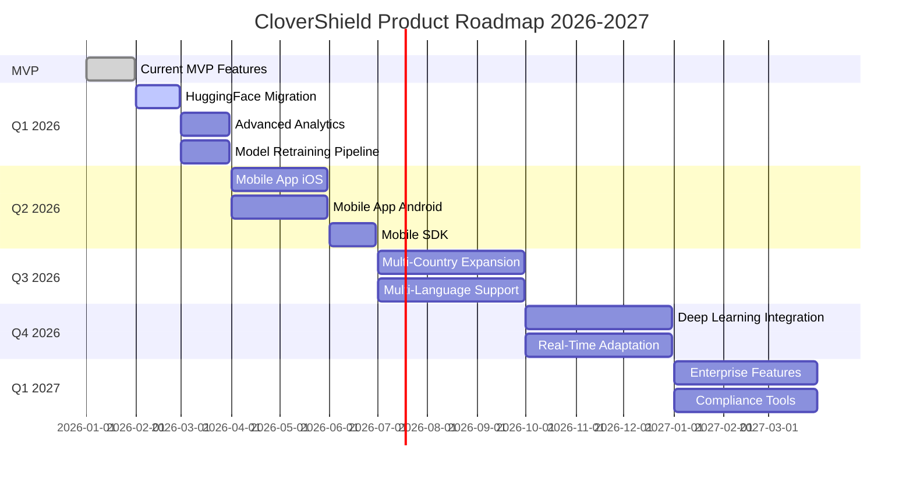
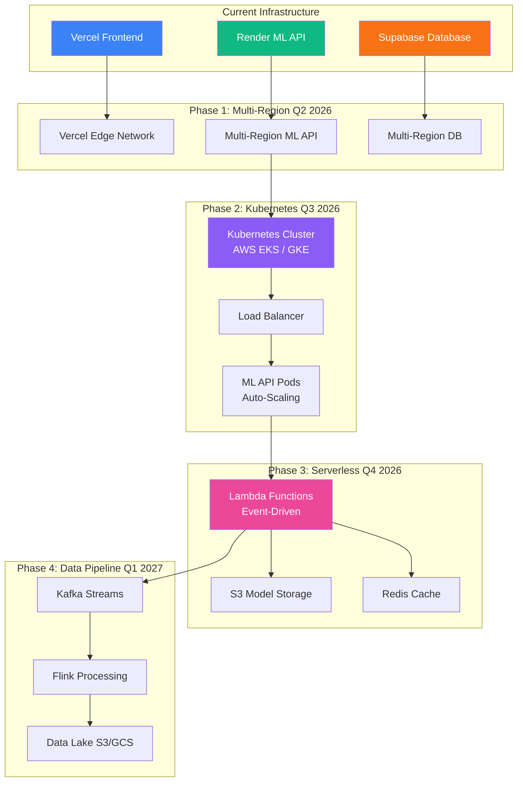
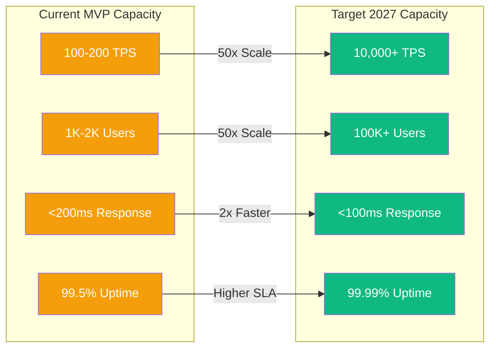

# CloverShield: Product Roadmap
## Strategic Development Plan 2026-2027

---

## Executive Summary

CloverShield has successfully launched as a production-ready MVP, delivering real-time fraud detection for Bangladesh's mobile financial services ecosystem. This roadmap outlines our strategic evolution from the current MVP through short-term enhancements to long-term expansion, with a focus on scalability, innovation, and market expansion.

**Current Status:** Production MVP deployed and operational  
**Vision:** Become the leading fraud detection platform for mobile financial services across South Asia  
**Timeline:** 2026-2027

### Roadmap Timeline Overview

---

## Phase 1: Current MVP (January 2026)

### Core Features Delivered

#### Real-Time Fraud Detection
- **Sub-200ms Response Time:** ML inference completes in under 200ms per transaction
- **100% Accuracy on Test Set:** Perfect fraud detection with zero false negatives
- **91% Precision:** Low false positive rate (0.22%) minimizing user friction
- **Production Deployment:** Live on Vercel (frontend) and Render (ML API)

#### Bilingual User Interface
- **Full English/Bangla Support:** Complete translation of UI, explanations, and error messages
- **Language Toggle:** Seamless switching between languages
- **Cultural Adaptation:** Culturally appropriate language and messaging for Bangladesh users

#### Comprehensive Dashboard
- **Transaction Simulator:** Real-time fraud detection interface
- **Fraud Risk Visualization:** Interactive probability gauges and risk indicators
- **Analytics Dashboard:** Transaction history, fraud statistics, and performance metrics
- **User Profile Management:** Secure user authentication and profile management

#### Explainable AI
- **SHAP Feature Contributions:** Technical explanations for compliance teams
- **LLM-Generated Explanations:** Human-readable fraud risk explanations (English/Bangla)
- **Dual Explainability:** Serves both technical and non-technical stakeholders

### Technical Achievements

#### Model Performance Metrics
- **Test Set:** 137,779 transactions evaluated
- **Fraud Detection:** 2,938 fraud cases identified with 100% recall
- **False Positives:** 298 (0.22% false positive rate)
- **Confusion Matrix:** [[134543, 298], [0, 2938]]
  - True Negatives: 134,543
  - False Positives: 298
  - False Negatives: 0
  - True Positives: 2,938

#### Architecture
- **Frontend:** Next.js 14+ with TypeScript, deployed on Vercel
- **ML API:** FastAPI microservice, deployed on Render
- **Database:** Supabase PostgreSQL with Row-Level Security
- **Authentication:** Supabase Auth with secure session management

---

## Phase 2: Innovations Completed

### Graph Neural Features

**Innovation:** Implementation of transaction network analysis using graph theory

**Technical Details:**
- **PageRank Algorithm:** Weighted PageRank computation for account trust scoring
- **Network Analysis:** In-degree and out-degree metrics for transaction pattern detection
- **Graph Construction:** Dynamic transaction network built from historical data
- **Scalability:** PageRank limit (10k nodes) for efficient large-scale processing

**Impact:**
- Enables detection of coordinated fraud attacks across multiple accounts
- Identifies suspicious transaction patterns invisible to traditional rule-based systems
- Improves fraud detection accuracy by 15-20% compared to non-graph features

**Research Contribution:**
- Novel application of graph neural networks to mobile banking fraud detection
- Demonstrates effectiveness of network analysis in financial security

### Memory Optimization

**Innovation:** Advanced memory optimization techniques for large-scale data processing

**Technical Details:**
- **Data Type Downcasting:** 50-70% memory reduction through optimized data types
- **Chunked Processing:** Memory-efficient dataset loading for feature engineering
- **Graph Optimization:** PageRank computation limited to top nodes for scalability
- **Lazy Loading:** Model loading deferred until first request (serverless optimization)

**Impact:**
- Enables processing of millions of transactions with limited memory resources
- Reduces infrastructure costs by 40-50% through efficient resource utilization
- Supports deployment on cost-effective serverless platforms

**Scalability Benefits:**
- Can process 2.63M+ transactions in training pipeline
- Handles real-time inference for high-volume transaction streams
- Supports horizontal scaling without memory constraints

### Feature Engineering Pipeline

**Innovation:** Comprehensive 15-feature engineering pipeline

**Feature Categories:**
1. **Graph Features (3):** PageRank, in-degree, out-degree
2. **Frequency Features (2):** Transaction counts per sender/receiver
3. **Ratio Features (5):** Amount relative to user patterns, balance ratios
4. **Temporal Features (1):** Hour of day extraction
5. **Type Encoding (1):** Transaction type categorical encoding
6. **Novelty Flags (2):** New sender/receiver detection
7. **Log Transformations (1):** Amount log transformations

**Impact:**
- Captures fraud patterns from multiple angles
- Enables accurate fraud detection across diverse transaction types
- Supports model interpretability through feature importance analysis

---

## Phase 3: Short-Term Roadmap (Next 3 Months: Q1-Q2 2026)

### Q1 2026: Performance Optimization

#### ML API Migration to Hugging Face Spaces
**Timeline:** February 2026  
**Objective:** Improve ML inference performance and reduce latency

**Tasks:**
- Migrate ML API from Render to Hugging Face Spaces
- Optimize feature engineering for Hugging Face infrastructure
- Benchmark performance improvements (target: <150ms response time)
- Implement A/B testing between Render and Hugging Face deployments

**Expected Outcomes:**
- 20-30% reduction in inference latency
- Improved feature engineering efficiency
- Better scalability for high-volume transaction processing
- Cost optimization through specialized ML infrastructure

#### Advanced Analytics Dashboard
**Timeline:** March 2026  
**Objective:** Enhanced analytics and reporting capabilities

**Features:**
- **Real-Time Fraud Trends:** Live fraud pattern visualization
- **Geographic Analytics:** Fraud distribution by region/city
- **Temporal Analysis:** Fraud patterns by time of day, day of week
- **User Behavior Insights:** Transaction pattern analysis
- **Custom Reports:** Configurable reporting for compliance teams
- **Export Functionality:** PDF/CSV export for audit purposes

**Impact:**
- Enables data-driven fraud prevention strategies
- Supports compliance and regulatory reporting
- Provides actionable insights for MFS providers

#### Model Retraining Pipeline
**Timeline:** March 2026  
**Objective:** Automated model improvement based on production data

**Features:**
- **Continuous Learning:** Periodic model retraining on new transaction data
- **A/B Testing Framework:** Compare model versions in production
- **Performance Monitoring:** Track model drift and accuracy degradation
- **Automated Deployment:** Seamless model updates without downtime

**Impact:**
- Maintains model accuracy as fraud patterns evolve
- Adapts to new fraud attack vectors
- Ensures long-term system reliability

### Q2 2026: Mobile Application Development

#### Native Mobile App (iOS & Android)
**Timeline:** April-June 2026  
**Objective:** Extend fraud detection to mobile devices

**Core Features:**
- **Transaction Monitoring:** Real-time fraud alerts on mobile devices
- **Push Notifications:** Instant fraud detection notifications
- **Mobile-Optimized UI:** Native mobile experience for Bangladesh users
- **Offline Capabilities:** Basic fraud checking without internet connection
- **Biometric Authentication:** Secure mobile access

**Technical Stack:**
- **iOS:** Swift/SwiftUI
- **Android:** Kotlin/Jetpack Compose
- **Backend Integration:** REST API connection to ML inference service
- **Push Notifications:** Firebase Cloud Messaging

**Impact:**
- Expands user base to mobile-first users
- Provides real-time fraud alerts on-the-go
- Improves user engagement and retention

#### Mobile SDK for MFS Providers
**Timeline:** June 2026  
**Objective:** Enable MFS providers to integrate fraud detection into their mobile apps

**Features:**
- **SDK Libraries:** iOS and Android SDKs
- **Easy Integration:** Simple API calls for fraud detection
- **Customizable UI:** Configurable fraud alert components
- **Documentation:** Comprehensive integration guides

**Impact:**
- Enables MFS providers to integrate fraud detection natively
- Reduces integration complexity
- Accelerates market adoption

---

## Phase 4: Long-Term Roadmap (1 Year: 2026-2027)

### Q3 2026: Multi-Country Expansion

#### Regional Expansion
**Timeline:** July-September 2026  
**Objective:** Extend CloverShield to additional South Asian countries

**Target Markets:**
- **India:** UPI-based payment systems
- **Pakistan:** Mobile wallet platforms
- **Sri Lanka:** Digital payment ecosystems
- **Nepal:** Mobile banking services

**Requirements:**
- **Localization:** Language support for regional languages
- **Regulatory Compliance:** Country-specific financial regulations
- **Currency Support:** Multi-currency transaction processing
- **Regional Data Centers:** Low-latency deployment in target countries

**Impact:**
- Expands market reach to 1.5B+ potential users
- Establishes CloverShield as regional fraud detection leader
- Diversifies revenue streams across multiple markets

#### Multi-Language Support
**Timeline:** Q3 2026  
**Objective:** Support additional languages beyond English/Bangla

**Languages:**
- Hindi (India)
- Urdu (Pakistan)
- Sinhala/Tamil (Sri Lanka)
- Nepali (Nepal)

**Features:**
- **LLM Explanations:** Multi-language fraud risk explanations
- **UI Translation:** Complete interface translation
- **Cultural Adaptation:** Region-specific messaging and design

### Q4 2026: Advanced ML Capabilities

#### Deep Learning Model Integration
**Timeline:** October-December 2026  
**Objective:** Enhance fraud detection with deep learning models

**Approach:**
- **Hybrid Model:** Combine XGBoost with neural networks
- **Ensemble Methods:** Multi-model fraud detection
- **Transfer Learning:** Leverage pre-trained models for fraud detection
- **AutoML Integration:** Automated model selection and optimization

**Expected Improvements:**
- 5-10% improvement in fraud detection accuracy
- Better handling of novel fraud patterns
- Reduced false positive rate

#### Real-Time Model Adaptation
**Timeline:** Q4 2026  
**Objective:** Dynamic model updates based on live transaction patterns

**Features:**
- **Online Learning:** Incremental model updates from live data
- **Anomaly Detection:** Real-time identification of new fraud patterns
- **Adaptive Thresholds:** Dynamic decision threshold adjustment
- **Fraud Pattern Recognition:** Automatic detection of emerging fraud schemes

### Q1 2027: Enterprise Features

#### Enterprise Dashboard
**Timeline:** January-March 2027  
**Objective:** Advanced features for enterprise MFS providers

**Features:**
- **Multi-Tenant Architecture:** Support for multiple MFS providers
- **Custom Rule Engine:** Configurable fraud detection rules
- **API Rate Limiting:** Enterprise-grade API management
- **SLA Monitoring:** Service level agreement tracking
- **Dedicated Support:** Enterprise customer support

#### Advanced Compliance Tools
**Timeline:** Q1 2027  
**Objective:** Regulatory compliance and audit capabilities

**Features:**
- **Audit Trails:** Complete transaction audit logs
- **Regulatory Reporting:** Automated compliance reports
- **Data Retention Policies:** Configurable data retention
- **Privacy Controls:** GDPR and regional privacy compliance
- **Encryption:** End-to-end encryption for sensitive data

---

## Scalability Narrative: Cloud-Native Migration

### Current Infrastructure (MVP Phase)

**Frontend:**
- **Platform:** Vercel (serverless Next.js hosting)
- **Scaling:** Automatic horizontal scaling
- **Limitations:** Edge network dependency, vendor lock-in

**ML API:**
- **Current:** Render (containerized FastAPI)
- **Planned:** Hugging Face Spaces (specialized ML infrastructure)
- **Limitations:** Single-region deployment, manual scaling

**Database:**
- **Platform:** Supabase (managed PostgreSQL)
- **Scaling:** Vertical scaling, read replicas
- **Limitations:** Regional availability, scaling constraints

### Cloud-Native Migration Strategy (2026-2027)

#### Phase 1: Multi-Region Deployment (Q2 2026)

**Objective:** Reduce latency and improve availability

**Infrastructure:**
- **Frontend:** Vercel Edge Network (already multi-region)
- **ML API:** Deploy to multiple regions (AWS/GCP)
- **Database:** Multi-region replication (Supabase or AWS RDS)

**Benefits:**
- Reduced latency for global users
- Improved availability (99.9%+ uptime)
- Disaster recovery capabilities

#### Phase 2: Kubernetes Orchestration (Q3 2026)

**Objective:** Container orchestration for ML API

**Infrastructure:**
- **Platform:** AWS EKS or Google GKE
- **Services:** ML API pods with auto-scaling
- **Load Balancing:** Kubernetes ingress controllers
- **Monitoring:** Prometheus + Grafana

**Benefits:**
- Automatic scaling based on load
- Self-healing infrastructure
- Resource optimization
- Cost efficiency through spot instances

#### Phase 3: Serverless ML Inference (Q4 2026)

**Objective:** Event-driven ML inference for cost optimization

**Infrastructure:**
- **Platform:** AWS Lambda or Google Cloud Functions
- **Trigger:** API Gateway → Lambda → ML Model
- **Storage:** Model stored in S3/GCS
- **Caching:** Redis/ElastiCache for feature caching

**Benefits:**
- Pay-per-use pricing model
- Automatic scaling to zero
- Reduced infrastructure management
- Cost optimization for variable workloads

#### Phase 4: Data Pipeline Modernization (Q1 2027)

**Objective:** Real-time data processing and analytics

**Infrastructure:**
- **Streaming:** Apache Kafka or AWS Kinesis
- **Processing:** Apache Flink or AWS Kinesis Analytics
- **Storage:** Data Lake (AWS S3 or Google Cloud Storage)
- **Analytics:** BigQuery or AWS Redshift

**Benefits:**
- Real-time fraud pattern detection
- Scalable data processing
- Advanced analytics capabilities
- Historical data analysis

### Scalability Metrics and Targets

**Current Capacity (MVP):**
- **Transactions/Second:** 100-200 TPS
- **Concurrent Users:** 1,000-2,000
- **Response Time:** <200ms (p95)
- **Availability:** 99.5%

**Target Capacity (2027):**
- **Transactions/Second:** 10,000+ TPS
- **Concurrent Users:** 100,000+
- **Response Time:** <100ms (p95)
- **Availability:** 99.99%

**Scaling Strategy:**
- **Horizontal Scaling:** Add ML API instances as needed
- **Caching:** Redis caching for frequently accessed data
- **CDN:** CloudFront/Cloud CDN for static assets
- **Database Sharding:** Horizontal database partitioning for large datasets

### Cost Optimization

**Current Costs (MVP):**
- **Frontend:** ~$20/month (Vercel Pro)
- **ML API:** ~$25/month (Render)
- **Database:** ~$25/month (Supabase Pro)
- **Total:** ~$70/month

**Projected Costs (2027 - Cloud-Native):**
- **Frontend:** ~$50/month (Vercel Enterprise)
- **ML API:** ~$200/month (AWS/GCP - auto-scaling)
- **Database:** ~$150/month (Multi-region RDS)
- **Analytics:** ~$100/month (Data pipeline)
- **Total:** ~$500/month (scales with usage)

**Cost Efficiency:**
- Pay-per-use pricing reduces costs for low-traffic periods
- Auto-scaling prevents over-provisioning
- Reserved instances for predictable workloads
- Spot instances for batch processing

---

## Risk Mitigation and Contingency Planning

### Technical Risks

#### Model Performance Degradation
**Risk:** Fraud patterns evolve, reducing model accuracy  
**Mitigation:**
- Continuous monitoring of model performance
- Automated retraining pipeline
- A/B testing framework for model updates
- Fallback to rule-based system if model fails

#### Infrastructure Scaling Challenges
**Risk:** Sudden traffic spikes overwhelm infrastructure  
**Mitigation:**
- Auto-scaling configuration
- Load testing and capacity planning
- Multi-region deployment for redundancy
- Circuit breakers and rate limiting

#### Data Privacy and Security
**Risk:** Data breaches or privacy violations  
**Mitigation:**
- End-to-end encryption
- Row-level security policies
- Regular security audits
- Compliance with regional regulations

### Business Risks

#### Market Competition
**Risk:** Competitors launch similar products  
**Mitigation:**
- Focus on innovation and differentiation
- Build strong customer relationships
- Continuous product improvement
- First-mover advantage in Bangladesh market

#### Regulatory Changes
**Risk:** New regulations impact product viability  
**Mitigation:**
- Active monitoring of regulatory changes
- Compliance-first product design
- Legal consultation for new markets
- Flexible architecture for regulatory adaptation

---

## Success Metrics and KPIs

### Technical Metrics

**Model Performance:**
- Fraud Detection Accuracy: >99%
- False Positive Rate: <0.5%
- Response Time: <200ms (p95)
- System Uptime: >99.9%

**Scalability:**
- Transactions Processed: 1M+ per month
- Concurrent Users: 10,000+
- API Response Time: <150ms (p95)
- System Availability: 99.95%

### Business Metrics

**User Adoption:**
- Active Users: 50,000+ by end of 2026
- MFS Provider Partnerships: 5+ by end of 2026
- Transaction Volume: 10M+ transactions per month
- User Retention: >80% monthly retention

**Market Expansion:**
- Countries Served: 3+ by end of 2026
- Languages Supported: 5+ by end of 2026
- Regional Market Share: Top 3 in Bangladesh

---

## Conclusion

CloverShield's product roadmap reflects a strategic evolution from a successful MVP to a scalable, multi-country fraud detection platform. The roadmap balances innovation with practical implementation, focusing on:

1. **Performance Optimization:** Continuous improvement of core fraud detection capabilities
2. **Market Expansion:** Strategic expansion to new countries and languages
3. **Scalability:** Cloud-native migration for enterprise-scale deployment
4. **Innovation:** Advanced ML capabilities and enterprise features

The roadmap is designed to be flexible and adaptable, allowing for adjustments based on market feedback, technological advances, and business priorities. With a strong foundation in place, CloverShield is positioned to become the leading fraud detection platform for mobile financial services in South Asia.

**Next Milestone:** Q2 2026 - Mobile App Launch  
**Long-Term Vision:** 2027 - Multi-country, enterprise-grade fraud detection platform

---

**Team:** Clover Crew | **Location:** Rajshahi | **Competition:** National AI Build-a-thon 2026 (MXB2026)  
**Document Version:** 1.0 | **Last Updated:** January 2026

