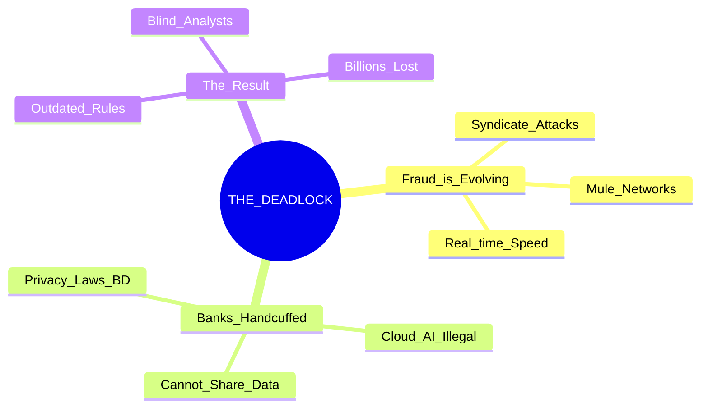
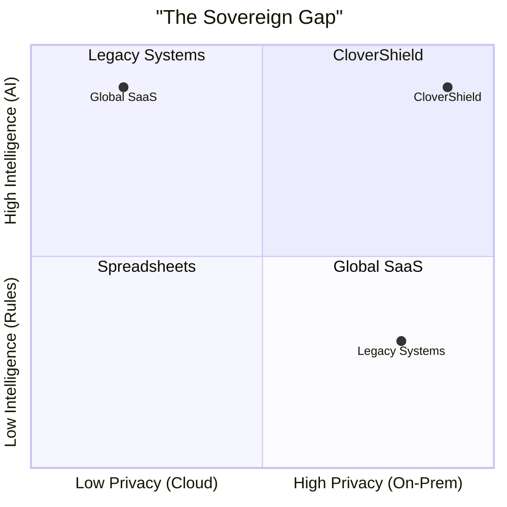
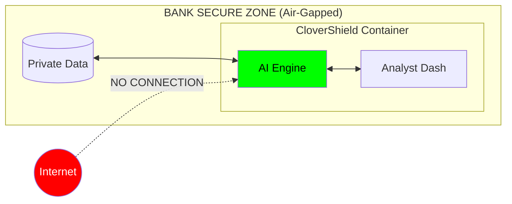
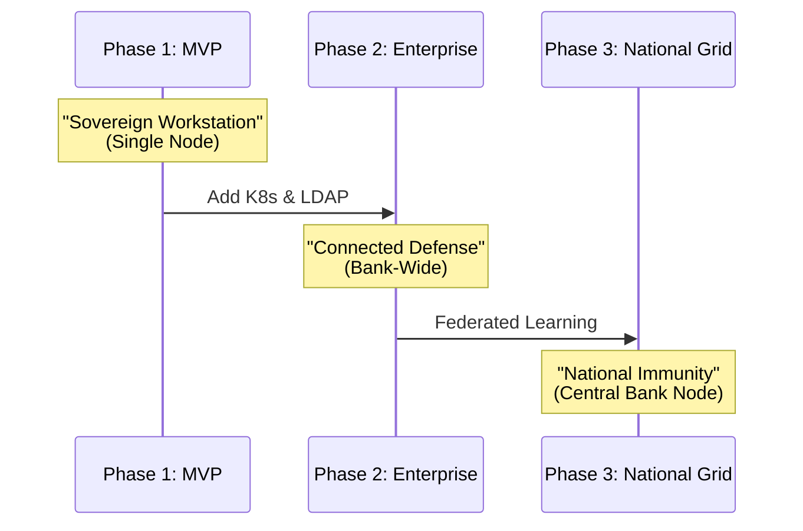

# 📊 Pitch Deck: CloverShield Sovereign AI
**Target Audience:** Judges, Investors, Bank CIOs  
**Theme:** "Ship the Code, Not the Data"

---

## 🟢 Slide 1: Title Card
**Visual:** Large CloverShield Logo (Neon Green Shield) on Dark Background.
**Text:**
# CloverShield
### The Sovereign AI Fraud Analyst Workstation
**Team:** Clover Crew (Rajshahi) | **Event:** National AI Build-a-thon 2026

---

## 🔴 Slide 2: The Privacy Paradox (The Problem)
**Visual:** A Mermaid Mindmap showing the deadlock banks face.

**Script:** "Banks in Bangladesh are fighting 21st-century fraud with 20th-century tools. Why? Because they can't upload sensitive data to the cloud AI giants. They are trapped in a deadlock."

---

## 🟡 Slide 3: The Market Gap
**Visual:** Quadrant Chart positioning CloverShield.

**Script:** "Existing solutions force a choice: Smart but Risky (Cloud AI) or Safe but Dumb (Legacy Rules). CloverShield creates a new category: **High Intelligence, Zero Data Leakage.**"

---

## 🟢 Slide 4: The Solution - A Sovereign Workstation
**Visual:** 4-Icon Layout representing the modules.

| 🖥️ **Mission Control** | 🧠 **Fraud Scanner** |
| :--- | :--- |
| **The Dashboard.**   localized "Heads-Up Display" prioritizing the top 1% of threats. | **The Engine.**   Real-time XGBoost + LLM Explanations (<200ms). |

| 🕸️ **Customer 360** | 🧪 **Policy Lab** |
| :--- | :--- |
| **The Lens.**   Network Graph to spot "Mule Rings" instantly. | **The Sandbox.**   Test new rules on history before going live. |

**Script:** "We built a unified workstation. It brings the AI *to* the data, running entirely inside the bank's secure walls."

---

## 🔵 Slide 5: How It Works (Architecture)
**Visual:** Simplified "Zero-Trust" Diagram.

**Script:** "This is our 'Zero-Trust' architecture. We ship the code in a Docker container. You plug it in. No data ever touches the internet."

---

## 🟣 Slide 6: The Innovation - Explainable AI (XAI)
**Visual:** Bar Chart of SHAP Values (The "Why").

```mermaid
gantt
    title "Transaction #98221 Analysis"
    dateFormat X
    axisFormat %s
    section Risk Drivers
    New Device Used       : 0, 80
    2AM Transaction       : 0, 60
    High Amount (>50k)    : 0, 40
    section Mitigators
    Known Beneficiary     : 0, 10
```

**Script:** "We don't just say 'Block'. We tell the analyst *why*. Our local LLM translates these math scores into plain Bangla: 'This user is sending 50k at 2 AM from a new device.'"

---

## 🟠 Slide 7: Unfair Advantage
**Visual:** Comparison Table.

| Feature | ☁️ Cloud AI | 🤖 Legacy Rules | 🛡️ CloverShield |
| :--- | :---: | :---: | :---: |
| **Data Privacy** | ❌ Unsafe | ✅ Safe | ✅ **Safe** |
| **Detection Power** | ✅ High | ❌ Low | ✅ **High** |
| **Latency** | ⚠️ >500ms | ✅ <10ms | ✅ **<200ms** |
| **Deployment** | ⚠️ Months | ✅ Weeks | ✅ **Minutes (Docker)** |

---

## 🔴 Slide 8: Roadmap & Business Model
**Visual:** Timeline.

**Script:** "We start by securing one analyst. We scale to secure the bank. Finally, using Federated Learning, we secure the nation—without sharing a single byte of private data."

---

## 🟢 Slide 9: Team Clover Crew
**Visual:** 2-Column Photo Layout.

| **[Team Lead]** | **[Member]** |
| :---: | :---: |
| **The Architect & Technical Lead** | **Presentation & Strategy** |
| *System Design & Technical Implementation* | *Presentation, Promotion, Documentation* |
| [Placeholder Img] | [Placeholder Img] |

**Script:** "We are Clover Crew. A fused unit of technical architecture and strategic execution."

---

## 🟢 Slide 10: The Ask
**Visual:** Big QR Code & Contact Info.

# Ready to Secure the Future?
### Deploy CloverShield Today.

`docker-compose up`

---
