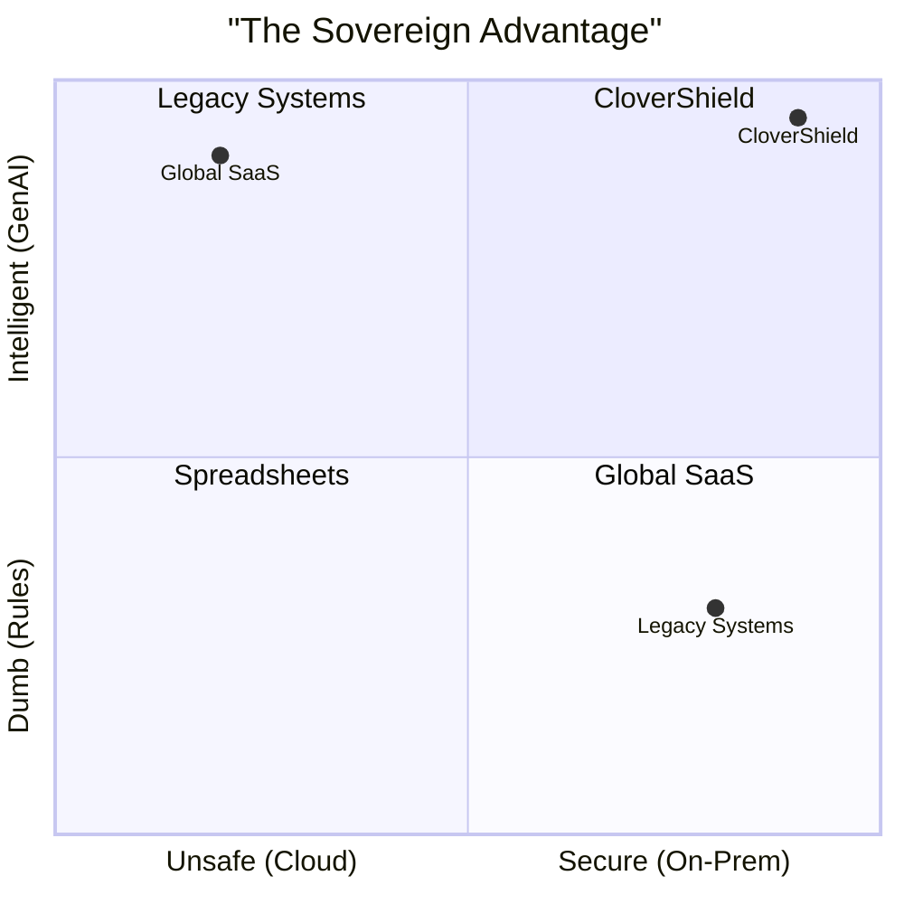

# 📊 Pitch Deck: CloverShield Sovereign AI
**Theme:** "Ship the Code, Not the Data"
**Event:** National AI Build-a-thon 2026 (MXB2026)

---

## 🟢 Slide 1: The Hook
**Visual:** A split screen. Left side: A bank vault (Locked Data). Right side: A futuristic AI brain (Cloud Intelligence). A jagged lightning bolt separates them.
**Headline:**
# The Privacy Paradox
### Banks have a choice: Stay Secure & Dumb, or Go Cloud & Illegal.
**Subtext:** "You can't upload citizen financial data to the cloud. But you can't fight modern fraud with 1990s Excel sheets. The industry is in a deadlock."

---

## 🔴 Slide 2: The Pain (Why Now?)
**Visual:** 3 Big Red Stats/Icons.
1.  **$X Billion Lost:** To syndicate fraud & mule networks.
2.  **0 Data Sharing:** Strict National Sovereignty Laws inhibit cloud SaaS.
3.  **Overwhelmed Analysts:** Human reviewers drowning in false positives without tools.

**Script:** "Fraud is evolving into organized crime. But our banks are fighting back with one hand tied behind their back—unable to use global AI tools due to strict data residency laws."

---

## 🟢 Slide 3: The Solution
**Visual:** Hero Shot of the **CloverShield Workstation** (Dark Mode Dashboard on a Monitor).
**Headline:**
# CloverShield
### The Sovereign AI Fraud Analyst Workstation
**The Big Idea:** "We don't ask you to send your data to the AI. We send the AI to your data."

---

## 🔵 Slide 4: Under the Hood (The Ecosystem)
**Visual:** Exploded view of the workstation capabilities.

| 🧠 **Fraud Scanner (Hybrid)** | 🖥️ **Mission Control** |
| :--- | :--- |
| **Hybrid Logic:** XGBoost (AI) + SQL Rules (Policy). <br> *Combines predictive power with hard safety nets.* | **The Dashboard:** Real-time investigative queue prioritizing the top 1% of threats. |

| 🕸️ **Customer 360** | 🤖 **Analyst Copilot** |
| :--- | :--- |
| **Network Graph:** Visualizes money trails to spot "Mule Rings" instantly. | **Local LLM:** A 24/7 AI Assistant that explains fraud in **Bangla & English**. |

---

## 🟣 Slide 5: The "Secret Sauce" (Why Us?)
**Visual:** A comparison showing our unique "Sovereign Tech Stack."

1.  **No-Code Model Registry:** Banks can retrain models with one click. **No Python required.**
2.  **Policy Lab (Sandbox):** Test new "Zero-Day" fraud rules on historical data before going live.
3.  **Air-Gapped QR Bridge:** Zero-trust way to import external evidence without any network connection.

**Script:** "We built features that competitors can't copy because they rely on the cloud. Our Policy Lab and Air-Gapped architecture are designed specifically for the secure, high-stakes environment of Bangladeshi banking."

---

## 📁 Slide 6: Operational Excellence & Compliance
**Visual:** A "Digital Dossier" icon and a PDF export icon.

*   **Organized Case Files:** A unified workspace for every investigation—evidence, notes, and checklists in one place.
*   **One-Click SAR Export:** Automatically generate **Suspicious Activity Reports (SAR)** formatted for regulatory compliance (BFIU).
*   **Secure Data Transfer:** The **QR Bridge** allows analysts to pull in external evidence (police docs) without ever breaking the air-gap.

**Script:** "We don't just detect fraud; we manage the entire investigation lifecycle. From organized case files to automated reporting, we save analysts hours of manual paperwork."

---

## 🟡 Slide 7: Competitive Landscape
**Visual:** Quadrant Chart.



**Script:** "Competitors exist in the 'High AI / Low Privacy' quadrant or the 'High Privacy / Low AI' quadrant. CloverShield stands alone: **Sovereign Intelligence.**"

---

## 🟠 Slide 7: Business Model & Traction
**Visual:** Simple "Land & Expand" Graphic.

1.  **The Product:** "Zero-Trust Container License." (Annual recurring fee per node).
2.  **The Service:** "Support & Custom Rule Development."
3.  **Deployment:** **Dockerized.** Deploys in minutes, not months.

**Script:** "We sell peace of mind in a box. One command (`docker-compose up`) deploys a bank-grade fraud system. No complex integration projects."

---

## 🔴 Slide 8: The Vision (Roadmap)
**Visual:** A Map of Bangladesh connecting dots.

*   **Now (Phase 1):** Secure the **Single Analyst** (Workstation).
*   **Next (Phase 2):** Secure the **Bank** (Enterprise Cluster).
*   **Future (Phase 3):** Secure the **Nation** (Federated Learning).

**Script:** "We start by empowering the individual analyst. But our endgame is **Federated Learning**—connecting every bank in Bangladesh to a shared defense grid without ever sharing a single byte of private customer data."

---

## 🟢 Slide 9: Team Clover Crew
**Visual:** Photos of the team.
**Tagline:** "Architects of Sovereign AI."
*   **Engineering:** Full-stack & ML capability.
*   **Strategy:** Deep understanding of the Fintech landscape.

---

## 🟢 Slide 10: The Ask
**Visual:** A terminal window with a blinking cursor.
```bash
$ docker-compose up clovershield
Starting defense protocols... [OK]
```

# Ready to Deploy?
### Safe. Smart. Sovereign.

**Contact:** Clover Crew | Rajshahi