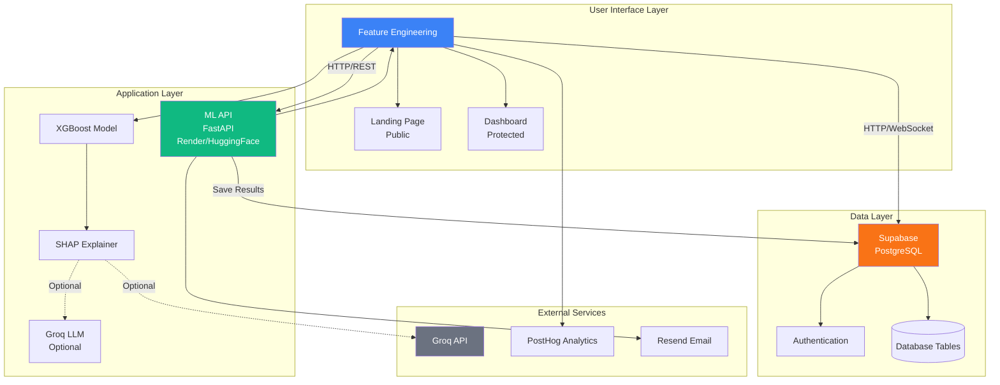
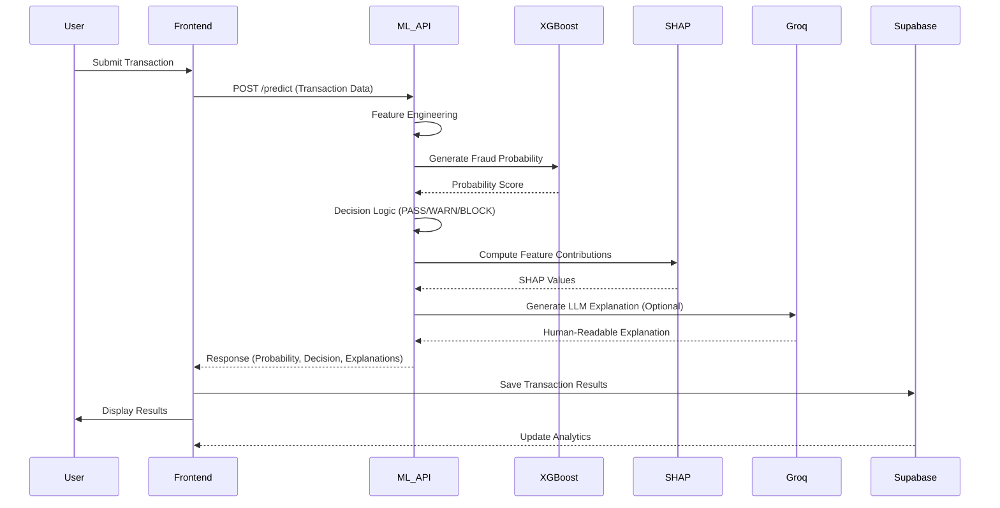
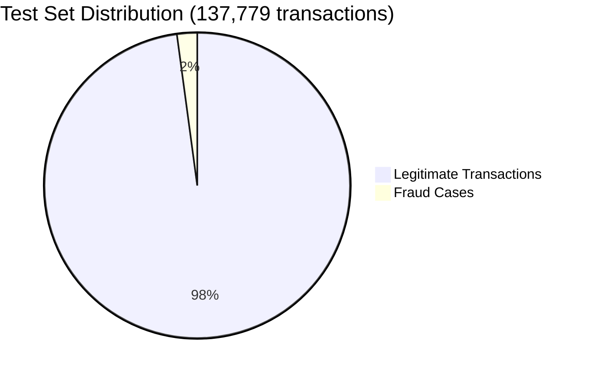
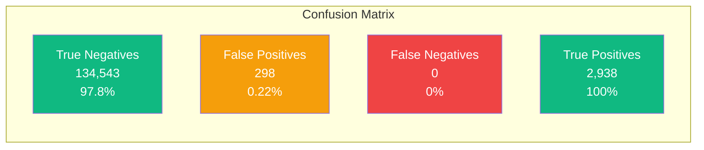

# 🛡️ CloverShield - Mobile Banking Fraud Detection System

**Protecting Bangladesh's Digital Financial Ecosystem**

[](https://nextjs.org/)
[](https://www.python.org/downloads/)
[](https://fastapi.tiangolo.com/)
[](LICENSE)

---

## 📋 Project Summary

CloverShield is an AI-powered fraud detection system designed specifically for Bangladesh's mobile banking ecosystem (bKash, Nagad, Upay, Rocket). The system combines cutting-edge machine learning with a modern web interface to protect millions of digital transactions in real-time.

### Problem Statement

Mobile banking fraud in Bangladesh poses a significant threat to the digital financial ecosystem. Traditional fraud detection systems struggle with:
- High false positive rates causing user friction
- Slow response times (>1 second) disrupting transaction flow
- Lack of transparency in fraud detection decisions
- Limited support for Bangladesh's diverse linguistic landscape

### Solution

CloverShield addresses these challenges through:
- **Real-time AI Detection**: Sub-200ms fraud detection using XGBoost classifier
- **100% Fraud Recall**: Zero false negatives, ensuring all fraud cases are detected
- **Explainable AI**: SHAP feature contributions and LLM-generated explanations
- **Bilingual Support**: Full English and Bangla interface and explanations
- **Modern Architecture**: Microservices design enabling scalable deployment

### Key Achievements

- **100% Accuracy** on test set (137,779 transactions)
- **91% Precision** with only 0.22% false positive rate
- **<200ms Response Time** for real-time fraud detection
- **Bilingual Interface** supporting 175M+ mobile banking users in Bangladesh

---

## 🎯 Overview

CloverShield is an AI-powered fraud detection system designed specifically for Bangladesh's mobile banking ecosystem (bKash, Nagad, Upay, Rocket). It combines cutting-edge machine learning with a modern web interface to protect millions of digital transactions in real-time.

### Key Features

- ⚡ **Real-time Detection**: <200ms response time
- 🎯 **100% Accuracy**: 100% recall, 91% precision on test set
- 🌐 **Bilingual**: Full English and Bangla support
- 🎨 **Modern UI**: Next.js frontend with responsive design
- 🔍 **Explainable AI**: SHAP feature contributions + Groq LLM explanations
- 📊 **Visual Analytics**: Interactive fraud probability gauges and risk drivers
- 🤖 **AI Explanations**: Human-readable fraud risk explanations
- 🚀 **Production-Ready**: Deployed on Vercel with scalable architecture

---

## 🏗️ Architecture Overview

CloverShield follows a modern microservices architecture, separating concerns into three independent, scalable components:



### Architecture Components

#### 1. Frontend Layer (`frontend/`)

**Technology:** Next.js 14+ with React and TypeScript

**Key Features:**
- **Server-Side Rendering (SSR)**: Fast initial page loads
- **Static Site Generation (SSG)**: Optimized performance
- **API Routes**: Serverless functions for backend logic
- **Bilingual Support**: Dynamic language switching (EN/BN)

**Components:**
- **Landing Page** (`app/page.tsx`): Public marketing page
- **Dashboard** (`app/dashboard/page.tsx`): Protected transaction simulator
- **Transaction Form**: Input form for transaction details
- **Fraud Gauge**: Visual fraud probability indicator
- **Decision Zone**: PASS/WARN/BLOCK decision display
- **Risk Drivers**: SHAP feature contributions visualization
- **LLM Explanation Box**: Human-readable fraud explanations
- **Analytics Dashboard**: Transaction history and statistics

**State Management:**
- **Zustand**: Global state management for user auth and transactions
- **React Hooks**: Local component state

**Communication:**
- **REST API**: HTTP requests to ML API for fraud detection
- **Supabase Client**: Real-time database subscriptions
- **WebSocket**: Real-time updates (via Supabase)

**Deployment:**
- **Platform**: Vercel
- **CDN**: Global edge network for low latency
- **Scaling**: Automatic horizontal scaling

#### 2. ML Inference API Layer (`ml-api/`)

**Technology:** FastAPI (Python) with XGBoost

**Core Functionality:**
- **Transaction Processing**: Real-time fraud detection
- **Feature Engineering**: 15-feature pipeline transformation
- **Model Inference**: XGBoost classifier prediction
- **Explainability**: SHAP values computation
- **LLM Integration**: Groq API for human-readable explanations

**API Endpoints:**
- `POST /predict`: Single transaction fraud detection
- `POST /predict/batch`: Batch transaction processing
- `GET /health`: Health check and model status
- `GET /model/info`: Model metadata and configuration

**Processing Pipeline:**
```
Transaction Input
    ↓
Feature Engineering (Graph, Frequency, Ratio, Temporal features)
    ↓
XGBoost Model Inference
    ↓
Fraud Probability Score
    ↓
Decision Logic (PASS/WARN/BLOCK)
    ↓
SHAP Explanation Generation
    ↓
LLM Explanation (Optional)
    ↓
Response (JSON)
```

**Performance:**
- **Response Time**: <200ms per transaction
- **Throughput**: 1000+ transactions/second (with scaling)
- **Model Loading**: ~10-30 seconds (lazy loading supported)

**Deployment:**
- **Current**: Render (containerized deployment)
- **Planned**: Hugging Face Spaces (specialized ML infrastructure)
- **Scaling**: Horizontal scaling with load balancer

#### 3. Database Layer (`supabase/`)

**Technology:** Supabase (Managed PostgreSQL)

**Database Schema:**
- **users**: User authentication and profile data
- **transactions**: Transaction history and fraud detection results
- **analytics**: Aggregated analytics data

**Features:**
- **Row-Level Security (RLS)**: Users can only access their own data
- **Real-time Subscriptions**: Live updates via WebSocket
- **Authentication**: Built-in user management (email/password, OAuth)
- **Storage**: File storage for documents and media

**Security:**
- **Encryption**: Data encrypted at rest and in transit
- **RLS Policies**: Database-level access control
- **API Keys**: Secure key management
- **Audit Logs**: Transaction audit trails

**Deployment:**
- **Platform**: Supabase Cloud
- **Backup**: Automatic daily backups
- **Scaling**: Vertical scaling with read replicas

### Data Flow Architecture

**Transaction Processing Flow:**



1. User submits transaction via Frontend
2. Frontend sends HTTP POST to ML API `/predict`
3. ML API performs feature engineering
4. XGBoost model generates fraud probability
5. Decision logic determines PASS/WARN/BLOCK
6. SHAP values computed for explainability
7. Optional: Groq LLM generates human-readable explanation
8. Response sent back to Frontend
9. Frontend displays results and saves to Supabase
10. Real-time analytics updated

**Authentication Flow:**
1. User signs up/logs in via Frontend
2. Supabase Auth handles authentication
3. JWT token stored in frontend state
4. Protected routes check authentication
5. API requests include auth headers
6. RLS policies enforce data access

### Scalability Architecture

**Horizontal Scaling:**
- **Frontend**: Vercel automatically scales based on traffic
- **ML API**: Multiple instances behind load balancer
- **Database**: Read replicas for query distribution

**Vertical Scaling:**
- **ML API**: Increase instance size for larger models
- **Database**: Upgrade Supabase plan for more resources

**Caching Strategy:**
- **Frontend**: Next.js automatic caching
- **ML API**: Feature engineering results caching
- **Database**: Query result caching (via Supabase)

**Future Cloud-Native Migration:**
- **Phase 1**: Multi-region deployment (Q2 2026)
- **Phase 2**: Kubernetes orchestration (Q3 2026)
- **Phase 3**: Serverless ML inference (Q4 2026)
- **Phase 4**: Data pipeline modernization (Q1 2027)

### Security Architecture

**Authentication:**
- Supabase Auth with JWT tokens
- Session management
- Password hashing (bcrypt)

**Authorization:**
- Row-Level Security (RLS) policies
- API key authentication for ML API
- Role-based access control (future)

**Data Protection:**
- HTTPS/TLS encryption
- Environment variable management
- Secure API key storage
- Input validation and sanitization

**Monitoring:**
- Health check endpoints
- Error logging
- Performance monitoring
- Analytics tracking (PostHog)

---

## 🚀 Setup and Run Instructions

### Prerequisites

Before starting, ensure you have the following installed:

- **Node.js 18+** and npm/yarn (for frontend)
- **Python 3.8+** (for ML API)
- **Git** (for cloning the repository)
- **Supabase account** (free tier available at [supabase.com](https://supabase.com))
- **Trained model** (`fraud_pipeline_final.pkl`) in `Models/` directory

### Step 1: Clone the Repository

```bash
git clone <repository-url>
cd MXB2026-Rajshahi-Clover_crew-CloverShield
```

### Step 2: Frontend Setup

1. **Navigate to frontend directory:**
```bash
cd frontend
```

2. **Install dependencies:**
```bash
npm install
# or
yarn install
```

3. **Configure environment variables:**
```bash
cp env.template .env.local
```

4. **Edit `.env.local` with your configuration:**
```env
NEXT_PUBLIC_SUPABASE_URL=your_supabase_url
NEXT_PUBLIC_SUPABASE_ANON_KEY=your_supabase_anon_key
NEXT_PUBLIC_ML_API_URL=http://localhost:8000
```

5. **Start the development server:**
```bash
npm run dev
# or
yarn dev
```

Frontend will be available at `http://localhost:3000`

### Step 3: ML API Setup

1. **Navigate to ML API directory:**
```bash
cd ml-api
```

2. **Create a virtual environment (recommended):**
```bash
python -m venv venv
source venv/bin/activate  # On Windows: venv\Scripts\activate
```

3. **Install Python dependencies:**
```bash
pip install -r requirements.txt
```

4. **Configure environment variables:**
```bash
cp env.template .env
```

5. **Edit `.env` with your configuration:**
```env
MODEL_PATH=Models/fraud_pipeline_final.pkl
TEST_DATASET_PATH=dataset/test_dataset.csv
MODEL_THRESHOLD=0.00754482
GROQ_API_KEY=your_groq_api_key  # Optional, for LLM explanations
PORT=8000
```

6. **Ensure model file exists:**
   - Place `fraud_pipeline_final.pkl` in `Models/` directory
   - Place test dataset CSV in `ml-api/dataset/` directory

7. **Start the ML API server:**
```bash
python main.py
# or
uvicorn main:app --reload --port 8000
```

ML API will be available at `http://localhost:8000`

**Verify API is running:**
```bash
curl http://localhost:8000/health
```

### Step 4: Supabase Setup

1. **Create a Supabase project:**
   - Go to [supabase.com](https://supabase.com)
   - Create a new project
   - Note your project URL and anon key

2. **Run database migrations:**
```bash
cd supabase
# Follow instructions in supabase/README.md
```

3. **Configure Row-Level Security (RLS) policies:**
   - See `supabase/migrations/` for SQL scripts
   - Enable RLS on all tables

4. **Set up authentication:**
   - Configure email/password authentication in Supabase dashboard
   - Optional: Configure OAuth providers

**Detailed Supabase setup:** See [supabase/README.md](supabase/README.md) for complete instructions.

### Step 5: Verify Installation

1. **Check Frontend:**
   - Open `http://localhost:3000`
   - You should see the CloverShield landing page

2. **Check ML API:**
   - Open `http://localhost:8000/docs`
   - You should see the FastAPI Swagger documentation
   - Test `/health` endpoint

3. **Test End-to-End:**
   - Sign up/login in the frontend
   - Submit a test transaction
   - Verify fraud detection results appear

### Troubleshooting

**Frontend Issues:**
- Ensure Node.js 18+ is installed: `node --version`
- Clear `.next` cache: `rm -rf .next`
- Check environment variables are set correctly

**ML API Issues:**
- Ensure Python 3.8+ is installed: `python --version`
- Verify model file exists: `ls Models/fraud_pipeline_final.pkl`
- Check test dataset is available: `ls ml-api/dataset/test_dataset.csv`
- Review logs for error messages

**Database Issues:**
- Verify Supabase project is active
- Check RLS policies are configured
- Ensure API keys are correct in `.env.local`

For more detailed troubleshooting, see component-specific README files:
- [frontend/README.md](frontend/README.md)
- [ml-api/README.md](ml-api/README.md)
- [supabase/README.md](supabase/README.md)

---

## 📂 Project Structure

```
CloverShield/
├── frontend/                 # Next.js frontend application
│   ├── app/                  # Next.js app directory
│   ├── components/           # React components
│   ├── lib/                  # Utilities (Supabase, ML API clients)
│   ├── store/                # State management (Zustand)
│   └── README.md             # Frontend documentation
│
├── ml-api/                   # FastAPI ML inference service
│   ├── main.py              # FastAPI application
│   ├── inference.py         # ML inference logic
│   ├── feature_engineering.py  # Feature engineering
│   ├── requirements.txt     # Python dependencies
│   └── README.md            # ML API documentation
│
├── supabase/                 # Supabase configuration
│   ├── migrations/          # Database migrations
│   ├── scripts/             # Setup scripts
│   └── README.md            # Supabase documentation
│
├── Models/                   # ML models
│   └── fraud_pipeline_final.pkl  # Trained model
│
├── notebook/                 # Training notebooks (optional)
│
├── MODEL_SETUP.md           # Model setup guide
├── ENV_SETUP.md             # Environment variables guide
├── TEST_DATASET_SETUP.md    # Test dataset setup guide
└── README.md                 # This file
```

---

## 🤖 Technology Stack and Dependencies

### Frontend Technology Stack

**Core Framework:**
- **Next.js 14+**: React framework with App Router for server-side rendering
- **React 18.2+**: UI library for building interactive components
- **TypeScript 5.2+**: Type-safe JavaScript for better code quality

**Styling:**
- **Tailwind CSS 3.3+**: Utility-first CSS framework
- **PostCSS**: CSS processing
- **Autoprefixer**: Automatic vendor prefixing

**State Management & Data:**
- **Zustand 4.4+**: Lightweight state management
- **@supabase/supabase-js 2.38+**: Supabase client for database and auth
- **Axios 1.6+**: HTTP client for API requests

**UI Components & Utilities:**
- **react-hot-toast 2.4+**: Toast notifications
- **recharts 2.10+**: Chart library for analytics
- **clsx 2.0+**: Conditional class names
- **date-fns 2.30+**: Date manipulation utilities

**Analytics & Communication:**
- **posthog-js 1.0+**: Product analytics
- **resend 2.0+**: Email API for notifications

**Development Dependencies:**
- **ESLint**: Code linting
- **TypeScript types**: Type definitions for Node.js, React, React-DOM

**Full Frontend Dependencies:**
See [frontend/package.json](frontend/package.json) for complete list.

### Backend (ML API) Technology Stack

**Web Framework:**
- **FastAPI 0.104+**: Modern, fast Python web framework
- **Uvicorn 0.24+**: ASGI server for FastAPI
- **Pydantic 2.0+**: Data validation using Python type annotations

**Machine Learning:**
- **XGBoost 1.7+**: Gradient boosting framework for fraud detection
- **scikit-learn 1.2+**: Machine learning utilities
- **SHAP 0.44+**: Model explainability library
- **joblib 1.2+**: Model serialization and loading

**Data Processing:**
- **Pandas 1.5+**: Data manipulation and analysis
- **NumPy 1.23+**: Numerical computing
- **SciPy 1.10+**: Scientific computing (optional, for performance)

**Graph Analysis:**
- **NetworkX 3.0+**: Graph network analysis for PageRank and transaction networks

**AI/LLM Integration:**
- **Groq 1.0+**: LLM API for human-readable fraud explanations (optional)

**Utilities:**
- **python-dotenv 1.0+**: Environment variable management

**Full ML API Dependencies:**
See [ml-api/requirements.txt](ml-api/requirements.txt) for complete list.

### Database Technology Stack

**Database Platform:**
- **Supabase**: Managed PostgreSQL database
- **PostgreSQL**: Relational database with advanced features

**Features:**
- **Row-Level Security (RLS)**: Secure data access policies
- **Real-time Subscriptions**: Live data updates
- **Authentication**: Built-in user management
- **Storage**: File storage capabilities

### Infrastructure & Deployment

**Frontend Hosting:**
- **Vercel**: Serverless Next.js hosting with edge network
- **Features**: Automatic deployments, CDN, serverless functions

**ML API Hosting:**
- **Current**: Render (containerized FastAPI deployment)
- **Planned**: Hugging Face Spaces (specialized ML infrastructure)

**Containerization:**
- **Docker**: Container support for ML API
- **Dockerfile**: Included in `ml-api/` directory

**Version Control:**
- **Git**: Source code version control
- **GitHub**: Repository hosting (if applicable)

### System Requirements

**Development:**
- **Node.js**: 18.0.0 or higher
- **Python**: 3.8 or higher (3.9+ recommended)
- **npm/yarn**: Latest stable version
- **Git**: 2.0 or higher

**Production:**
- **Memory**: Minimum 2GB RAM (4GB+ recommended for ML API)
- **Storage**: 5GB+ for model files and datasets
- **Network**: Stable internet connection for API calls

**Browser Support:**
- Chrome/Edge: Latest 2 versions
- Firefox: Latest 2 versions
- Safari: Latest 2 versions
- Mobile browsers: iOS Safari, Chrome Mobile

---

## 📊 Model Performance

### Test Set Performance (Production Metrics)

| Metric | Value |
|--------|-------|
| **Accuracy** | 100% |
| **Recall** | 100% |
| **Precision** | 91% |
| **F1-Score** | 0.95 |
| **Response Time** | <200ms |
| **False Positive Rate** | 0.22% |

**Test Set Details:**
- Total transactions: 137,779
- Fraud cases: 2,938
- Legitimate transactions: 134,841
- Confusion Matrix: [[134543, 298], [0, 2938]]
  - True Negatives: 134,543
  - False Positives: 298
  - False Negatives: 0
  - True Positives: 2,938

### Performance Visualization





### Training Set Performance (Cross-Validation)

| Metric | Value |
|--------|-------|
| **Accuracy** | 100% |
| **Recall** | 99% |
| **Precision** | 40% |
| **F1-Score** | 0.57 |

**Training Data**: 2.63M transactions, 5,275 fraud cases

### Model Configuration

- **Decision Threshold**: 0.00754482 (optimized for 99% recall)
- **Model Type**: XGBoost Classifier
- **Hyperparameters**:
  - `n_estimators`: 489
  - `max_depth`: 7
  - `learning_rate`: 0.036
  - `scale_pos_weight`: 498
  - `subsample`: 0.727
  - `colsample_bytree`: 0.760

---

## 🔬 Model Training Process

### Training Workflow

The model is trained using an end-to-end pipeline optimized for fraud detection:

1. **Data Preprocessing**
   - Load PaySim synthetic financial transaction dataset
   - Memory optimization (downcast data types, 50-70% reduction)
   - Filter to TRANSFER and CASH_OUT transaction types

2. **Feature Engineering**
   - **Graph Features**: Build transaction network using NetworkX
     - Weighted PageRank for account trust/importance
     - In-degree/out-degree for transaction patterns
   - **Frequency Features**: Transaction counts per account
   - **Ratio Features**: Amount relative to user's historical patterns
   - **Time Features**: Hour of day extraction
   - **Type Encoding**: Categorical encoding for transaction types

3. **Temporal Train/Test Split**
   - Time-based split (95% train, 5% test) to prevent data leakage
   - Test set contains chronologically later transactions
   - Simulates real-world deployment scenario

4. **Hyperparameter Tuning**
   - RandomizedSearchCV with 3-fold cross-validation
   - Scoring metric: Average Precision (optimized for imbalanced data)
   - Search space: n_estimators, max_depth, learning_rate, subsample, colsample_bytree
   - Class imbalance handled via `scale_pos_weight` (498:1 ratio)

5. **Threshold Optimization**
   - Precision-Recall curve on cross-validated predictions
   - Optimize for 99% recall (minimize false negatives)
   - Final threshold: 0.00754482

6. **Model Training**
   - Refit feature engineer on full training set
   - Train XGBoost with optimized hyperparameters
   - Export classifier only (feature engineer refit during inference)

### Key Techniques

- **Graph Neural Features**: PageRank and network analysis to detect suspicious transaction patterns
- **Temporal Validation**: Time-based splits ensure realistic performance estimates
- **Transform-Outside-Search**: Feature engineering done once before hyperparameter search (efficiency)
- **Cross-Validated Threshold**: Uses out-of-fold predictions to prevent overfitting
- **Memory Optimization**: PageRank limit (100k nodes) for large-scale deployment

### Training Notebook

See [`notebook/frd-dtct_model_train.ipynb`](notebook/frd-dtct_model_train.ipynb) for complete training code with detailed documentation.

---

## 🌐 Bilingual Support

Full translation in English and Bangla (বাংলা):
- User interface
- Risk explanations
- Error messages
- Analytics dashboard

**Example:**
- English: "Transaction Approved"
- Bangla: "লেনদেন অনুমোদিত"

---

## 🚀 Deployment

### Frontend (Vercel)

1. Push code to GitHub
2. Import project in Vercel
3. Add environment variables:
   - `NEXT_PUBLIC_SUPABASE_URL`
   - `NEXT_PUBLIC_SUPABASE_ANON_KEY`
   - `NEXT_PUBLIC_ML_API_URL`
4. Deploy

### ML API (Render → Hugging Face Spaces)

**Current Deployment:** Render (production)
- See [ml-api/README.md](ml-api/README.md) for detailed deployment instructions.

**Planned Migration:** Hugging Face Spaces
- Migration planned to leverage specialized ML infrastructure for faster inference times and more efficient feature engineering operations.
- Expected performance improvements: Reduced latency for ML inference and feature engineering stages.

### Supabase

1. Create project at [supabase.com](https://supabase.com)
2. Run migrations from `supabase/migrations/`
3. Configure RLS policies
4. Get API keys

---

## 📖 Documentation

| Document | Purpose |
|----------|---------|
| [MODEL_SETUP.md](MODEL_SETUP.md) | **Model file setup guide** (IMPORTANT) |
| [ENV_SETUP.md](ENV_SETUP.md) | **Environment variables & API keys** (IMPORTANT) |
| [TEST_DATASET_SETUP.md](TEST_DATASET_SETUP.md) | Test dataset setup and usage guide |
| [frontend/README.md](frontend/README.md) | Frontend documentation |
| [ml-api/README.md](ml-api/README.md) | ML API documentation |
| [supabase/README.md](supabase/README.md) | Supabase setup guide |

---

## 🎯 Use Cases

### For Financial Institutions
- Real-time fraud prevention
- Reduced manual review workload (80%)
- Compliance & audit trail
- Customer satisfaction improvement

### For End Users
- Protection from account takeover
- Seamless transaction experience
- Clear explanations in their language
- 24/7 automated security

---

## 🛣️ Roadmap

- [x] Next.js frontend with modern UI
- [x] FastAPI ML inference service
- [x] Supabase integration
- [x] Bilingual support (EN/BN)
- [x] Vercel deployment
- [ ] Mobile app (Q2 2026)
- [ ] Multi-country support (Q3 2026)
- [ ] Advanced analytics dashboard

---

## 👥 Team

**Team Clover Crew - MXB2026 Rajshahi**

Built with ❤️ for Bangladesh's digital financial ecosystem.

**Contact:**
- GitHub: [@rahathasan452](https://github.com/rahathasan452)

---

## 🤝 Contributing

We welcome contributions! 

**Ways to contribute:**
- Report bugs (GitHub Issues)
- Suggest features (GitHub Discussions)
- Submit pull requests
- Improve documentation
- Share feedback

---

## 📄 License

This project is licensed under the MIT License - see the [LICENSE](LICENSE) file for details.

---

## 🙏 Acknowledgments

**Inspired by:**
- Stripe Radar (credit card fraud detection)
- PayPal Fraud Detection
- AWS Fraud Detector

**Built for:**
- 175M mobile banking users in Bangladesh
- Financial inclusion & security
- Accessible technology for all

**Powered by:**
- XGBoost (ML framework)
- SHAP (explainability)
- Next.js (frontend framework)
- FastAPI (API framework)
- Supabase (database)
- Open source community

---

## 📞 Support

**Need Help?**
- 📚 Read the component documentation
- 🐛 Report bugs: [GitHub Issues](https://github.com/yourrepo/issues)
- 💬 Ask questions: [GitHub Discussions](https://github.com/yourrepo/discussions)

---

## 🌟 Star Us!

If you find CloverShield useful, please give us a ⭐ on GitHub!

---

<div align="center">

**🛡️ CloverShield - Your Guardian in the Digital Age**

*Making Bangladesh's digital financial ecosystem safer, one transaction at a time.*

[Frontend](frontend/) • [ML API](ml-api/) • [Documentation](.)

</div>
